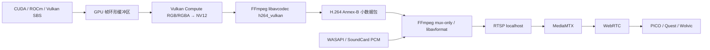

# 高级网络推流的 Vulkan 图像传输实现指南

本文定义 Desktop2Stereo“高级网络推流”增加 Vulkan 图像路径的实现方法、模块边界、回退策略和验收要求。

目标是消除当前 4K SBS 推流中的 CUDA/ROCm → CPU RGB24 → FFmpeg stdin 路径，让图像在 GPU 内完成 SBS 整理、颜色转换和硬件编码。编码后的 H.264/H.265 小数据包仍通过 FFmpeg/MediaMTX 发布，并由局域网头显浏览器通过 WebRTC 播放。

> 本文同时记录实施设计和当前验收状态。native Vulkan 编码桥已完成独立 4K 编码烟测并接入高级网络推流；本机已完成连续 600 帧 3840×2160@30 发布和 ffprobe 媒体参数验证；SoundCard/WASAPI 连续运行 10.12 秒无 runtime error，MediaMTX 确认 `2 tracks (H264, Opus)`。头显端持续 4K/30 FPS 实机验收仍需继续完成；Khronos validation 层会触发 FFmpeg 内部 NV12 frame-pool 的已知 VUID 与 flush/idle 阻塞，程序检测到该层后主动回退稳定 host-upload 路径。

## 目录

- [当前瓶颈](#当前瓶颈)
- [Vulkan 在本方案中的含义](#vulkan-在本方案中的含义)
- [目标数据流](#目标数据流)
- [为什么不能只修改 FFmpeg 命令](#为什么不能只修改-ffmpeg-命令)
- [高级推流与 GPU 推流的区别](#高级推流与-gpu-推流的区别)
- [平台支持范围](#平台支持范围)
- [模块设计](#模块设计)
- [GPU 图像格式和颜色转换](#gpu-图像格式和颜色转换)
- [同步与缓冲区生命周期](#同步与缓冲区生命周期)
- [FFmpeg Vulkan 编码桥](#ffmpeg-vulkan-编码桥)
- [音频和 MediaMTX](#音频和-mediamtx)
- [能力探测与回退](#能力探测与回退)
- [GUI 和配置建议](#gui-和配置建议)
- [分阶段实施](#分阶段实施)
- [测试与验收](#测试与验收)
- [性能指标](#性能指标)
- [日志规范](#日志规范)
- [常见故障](#常见故障)
- [实现检查清单](#实现检查清单)

## 当前瓶颈

当前高级推流由 `streaming/direct_sbs.py` 中的 `FfmpegDirectSbsOutput` 完成，主要路径为：

```text
CUDA/ROCm SBS Tensor
        ↓ 下载到 CPU
NumPy RGB24
        ↓ memoryview + stdin 写入
FFmpeg rawvideo 输入
        ↓ RGB24 → YUV420P/NV12
NVENC/AMF/QSV/VideoToolbox 或 CPU 编码
        ↓ RTSP
MediaMTX
        ↓ WebRTC
PICO/Quest/Wolvic 浏览器
```

代码中的关键现状：

- `DirectSbsOutputConsumer` 在输出对象没有 `submit_cuda_frame()` 时调用 `RuntimeSbsRgbConverter`。
- FFmpeg 输入固定为 `-f rawvideo -pixel_format rgb24 -i pipe:0`。
- `_write_frame()` 将整帧通过 Python 子进程 stdin 写入。
- 编码器可以是 NVENC、AMF、QSV、VAAPI 或 VideoToolbox，但输入在进入 FFmpeg 前已经落到 CPU。

4K、48 FPS 的 RGB24 原始数据吞吐约为：

```text
3840 × 2160 × 3 × 48 ≈ 1.19 GB/s
```

这还不包括 CUDA 下载、NumPy 布局转换、Python pipe 复制、FFmpeg RGB→YUV 和再次上传编码器的成本。该路径容易造成提交线程阻塞、帧队列覆盖、FFmpeg 输入不连续和 WebRTC 端卡顿。

## Vulkan 在本方案中的含义

“Vulkan 图像传输”指 GPU 内部图像通路，不是局域网传输协议。

各层职责如下：

| 层 | 技术 | 职责 |
| --- | --- | --- |
| 推理与 SBS 合成 | CUDA、ROCm 或 Vulkan Compute | 生成左右眼 SBS 图像 |
| GPU 图像交换 | Vulkan external memory | 在计算后端和 Vulkan 间共享图像内存 |
| GPU 同步 | Vulkan/CUDA/HIP external timeline semaphore | 保证生产者和编码器不会同时读写同一槽位 |
| 颜色转换 | Vulkan Compute | RGBA/RGB → NV12 或 P010 |
| 视频编码 | FFmpeg `h264_vulkan`/`hevc_vulkan` | 使用 Vulkan Video Encode 生成压缩码流 |
| 本机发布 | RTSP 或 SRT | 将压缩码流交给 MediaMTX |
| 头显播放 | WebRTC | 浏览器接收 H.264/Opus |

局域网头显浏览器不能直接接收 Vulkan 图像。Vulkan 只用于电脑端 GPU 内部处理，网络上仍发送压缩视频。

## 目标数据流



目标路径必须满足：

1. 每帧不创建新的 GPU 图像、内存、信号量或编码上下文。
2. 正常工作时不调用 `.cpu()`、`.numpy()`、`cudaMemcpyDeviceToHost` 或等价操作。
3. 原始 4K 图像不经过 Python pipe。
4. pipe 中只允许传输压缩后的 H.264/H.265 数据包或低带宽音频。
5. 帧落后时丢弃旧帧，不积压高延迟队列。

## 为什么不能只修改 FFmpeg 命令

FFmpeg 的 `h264_vulkan` 编码器只接受 `AV_PIX_FMT_VULKAN` 硬件帧。当前 `pipe:0` 是普通字节流，只能表达 RGB24 等 CPU 图像，不能表达：

- `VkImage`
- `VkDeviceMemory`
- Vulkan device/queue
- 图像布局和 queue-family ownership
- external memory handle
- timeline semaphore 及其计数值

因此下面这种思路不能得到零拷贝路径：

```text
Python RGB24 pipe → FFmpeg hwupload → h264_vulkan
```

它仍然先下载到 CPU，再由 FFmpeg上传到 Vulkan。

真正的 Vulkan 路径需要以下两种实现之一：

1. **推荐：进程内 FFmpeg 编码桥。** C/C++ 原生模块链接 `libavcodec`、`libavutil`，直接向 `h264_vulkan` 提交 `AV_PIX_FMT_VULKAN` 帧。
2. **不建议首期采用：跨进程 GPU IPC。** 自定义 FFmpeg 输入设备，通过 Win32 Handle 或 Linux FD 传递 external memory 和 semaphore。该方案平台差异大、句柄生命周期复杂，还需要维护 FFmpeg 补丁。

首期应选择进程内编码桥，压缩后的码流再交给现有 FFmpeg muxer。

### 2026-08-22 验证结论：不要把 NV12 拆成两个编码输入 image

Windows RTX 3090、NVIDIA Vulkan 驱动 610.88 和项目 FFmpeg 9.0.1 `d2s.2` 的
Validation Layer 实测表明，`h264_vulkan` / `hevc_vulkan` 的 Video Session 要求
输入为单一 `VK_FORMAT_G8_B8R8_2PLANE_420_UNORM` image。为了让 CUDA 导入，FFmpeg
frame pool 设置 `AV_VK_FRAME_FLAG_DISABLE_MULTIPLANE` 后会得到 `R8_UNORM` 与
`R8G8_UNORM` 两个 image；它们可导出 external-memory handle，却不具备
`VK_FORMAT_FEATURE_VIDEO_ENCODE_INPUT_BIT_KHR`，不能作为 Vulkan Video Encode 源。

因此“CUDA 分别写 Y、UV 两个 FFmpeg image，再提交 Vulkan Video”在该驱动上不可用，
必须保持自动回退。FFmpeg 9.0.1 的 `hwcontext_vulkan.h` 进一步明确：
`AV_VK_FRAME_FLAG_DISABLE_MULTIPLANE` 是导出/导入 CUDA image 所需的标志，启用后正是
R8/R8G8 拆分表示；不启用它才能保留单一 NV12 image，但当前 CUDA importer 没有合法的
multi-plane optimal-tiled image 映射接口。因此当前版本选择 Vulkan Compute + device-local
copy，并禁止把两个单 plane image 伪装成 NV12 编码输入。未来若 FFmpeg 提供真正的
multi-plane external-memory CUDA 映射，再切换到 CUDA 直接写入路径。

## 高级推流与 GPU 推流的区别

加入 Vulkan 后，两种模式仍应保持不同定位。

| 模式 | 定位 | 首选编码路径 | 平台策略 |
| --- | --- | --- | --- |
| 高级网络推流 | 跨厂商、跨平台、自动回退 | Vulkan Video → 厂商 FFmpeg 后端 → CPU | NVIDIA、AMD、Intel；macOS 用 VideoToolbox |
| GPU 推流 | 厂商专用最低延迟路径 | PyNvVideoCodec、AMF 原生桥等 | 按显卡厂商实现 |

高级推流不直接变成 PyNvVideoCodec 模式。Vulkan 是高级推流中的跨厂商 GPU 路径；GPU 推流继续保留厂商专用 API 和独立诊断信息。

推荐回退顺序：

```text
高级推流 Auto
├─ Windows/Linux：h264_vulkan / hevc_vulkan
├─ Windows：NVENC → QSV → AMF
├─ Linux：QSV → VAAPI
├─ macOS：VideoToolbox
└─ libx264 / libx265

GPU 推流 Auto
├─ NVIDIA：PyNvVideoCodec
├─ AMD：HIP → D3D11 → AMF
└─ 回退到高级推流 Auto
```

## 平台支持范围

| 平台 | Vulkan 图像路径 | Vulkan Video 编码 | 默认策略 |
| --- | --- | --- | --- |
| Windows + NVIDIA | CUDA external memory/semaphore | 支持时启用 | 首个实施与验收目标 |
| Linux + NVIDIA | CUDA external memory/semaphore FD | 支持时启用 | 第二阶段 |
| Windows + AMD | HIP/Vulkan 或 Vulkan Compute | 驱动支持时启用 | 保留 AMF 回退 |
| Linux + AMD | ROCm/Vulkan 或 Vulkan Compute | 驱动支持时启用 | 保留 VAAPI 回退 |
| Windows/Linux + Intel | Vulkan Compute/Vulkan image | 驱动支持时启用 | 保留 QSV/VAAPI 回退 |
| macOS | 不作为通用 Vulkan Video 目标 | 不强制 | 使用 VideoToolbox |

不能只检查显卡名称。运行时必须查询 Vulkan 扩展、视频队列、编码 Profile 和输入格式。

最低能力集合：

```text
VK_KHR_video_queue
VK_KHR_video_encode_queue
VK_KHR_video_encode_h264 或 VK_KHR_video_encode_h265
支持 VK_QUEUE_VIDEO_ENCODE_BIT_KHR 的 queue family
支持目标分辨率、Profile、Level 和输入格式
```

CUDA/ROCm 共享路径还需要对应的 external memory 和 external semaphore 扩展。在 Windows 使用 Win32 Handle，在 Linux 使用 FD。

## 模块设计

### 建议新增文件

```text
src/desktop2steoro/streaming/
├─ vulkan_encoder.py
├─ vulkan_capabilities.py
├─ encoded_packet_muxer.py
└─ native/
   └─ vulkan_ffmpeg_bridge/
      ├─ CMakeLists.txt
      ├─ bindings.cpp
      ├─ vulkan_frame_pool.cpp
      ├─ vulkan_color_convert.cpp
      ├─ ffmpeg_vulkan_encoder.cpp
      └─ include/
```

现有文件的修改范围：

| 文件 | 修改内容 |
| --- | --- |
| `streaming/direct_sbs.py` | 增加 `VulkanDirectSbsOutput`，复用服务器、码率、音频和关闭逻辑 |
| `streaming/nvidia_encoder.py` | 将压缩包 mux 部分抽成通用 `EncodedPacketMuxer` |
| `app_runtime/runtime_output.py` | 抽取 CUDA/ROCm→Vulkan 外部内存和信号量公共能力 |
| `viewer/vulkan_resources.py` | 复用句柄、内存类型和信号量工具；不要复用只适合 RGBA 展示的图像配置 |
| `gui/builders.py` | 后端选择增加 `Vulkan Video` |
| `gui/config_mgr.py` | 保存、加载并校验新后端值 |
| `streaming/rtmp/runtime-manifest.json` | 声明 FFmpeg Vulkan 编码和共享库能力 |

### Python 层接口

建议的 Python 包装接口：

```python
class VulkanVideoEncoder:
    def probe(self, *, codec: str, width: int, height: int) -> CapabilityReport: ...
    def open(self, *, width: int, height: int, fps: int,
             bitrate: int, peak_bitrate: int, codec: str) -> None: ...
    def submit_cuda(self, tensor, *, pts: int, force_idr: bool = False) -> None: ...
    def submit_vulkan(self, image, ready_semaphore, ready_value,
                      *, pts: int, force_idr: bool = False) -> None: ...
    def read_packets(self) -> list[bytes]: ...
    def flush(self) -> list[bytes]: ...
    def close(self) -> None: ...
```

`VulkanDirectSbsOutput` 实现 `submit_cuda_frame()`。这样 `DirectSbsOutputConsumer` 会跳过 `RuntimeSbsRgbConverter`，直接把 CUDA/ROCm Tensor 交给 Vulkan 路径。

### 原生桥职责

原生桥必须负责：

1. 创建或接管 Vulkan instance、physical device、device 和 video queue。
2. 创建固定大小的 NV12/P010 编码输入帧池。
3. 导入 CUDA/HIP 外部内存，或接受已有 `VulkanImageResource`。
4. 执行 GPU 颜色转换和图像布局转换。
5. 构造 `AVHWDeviceContext`、`AVHWFramesContext` 和 `AVFrame`。
6. 调用 `avcodec_send_frame()` / `avcodec_receive_packet()`。
7. 将压缩包复制为小型 CPU bytes 返回；不返回原始图像。
8. 在 close/异常路径正确等待和释放 GPU 对象。

Python 层不应直接管理裸 `VkImage` 或 `AVFrame` 生命周期。

## GPU 图像格式和颜色转换

### 不要以 RGB24 作为 Vulkan 编码输入

视频编码器通常需要 NV12 或 P010。推荐格式：

| 视频 | 输入格式 | 位深 | 用途 |
| --- | --- | --- | --- |
| H.264 | NV12 | 8 bit | WebRTC 浏览器兼容性优先 |
| H.265 | NV12 | 8 bit | Full-SBS 或明确支持 HEVC 的客户端 |
| H.265 HDR | P010 | 10 bit | 后续扩展，不作为首期目标 |

首期采用 H.264 + NV12 + BT.709 limited range。

### GPU 颜色转换

推荐使用 Vulkan Compute Shader 一次完成：

1. 读取 SBS RGBA/RGB 图像。
2. 按 BT.709 将 RGB 转换为 YUV。
3. 写入全分辨率 Y 平面。
4. 对 2×2 像素块进行色度采样，写入交错 UV 平面。
5. 对齐编码器报告的 `encodeInputPictureGranularity`。

必须在能力探测后调用 `vkGetPhysicalDeviceVideoFormatPropertiesKHR`，根据视频 Profile 查询真正支持 `VK_IMAGE_USAGE_VIDEO_ENCODE_SRC_BIT_KHR` 的格式。不能写死某个多平面 Vulkan Format 后假设所有驱动都支持。

色彩参数必须随帧或编码上下文明确设置：

```text
color_primaries = BT.709
color_trc       = BT.709
colorspace      = BT.709
color_range     = limited
chroma_location = left
```

错误的矩阵或范围会导致头显端发灰、黑位抬升、颜色偏绿或过饱和。

## 同步与缓冲区生命周期

### 使用固定环形缓冲区

沿用现有 Vulkan Viewer 的思路，默认使用 3 个槽位：

```text
slot 0：编码器读取
slot 1：颜色转换写入
slot 2：等待下一帧
```

每个槽位至少包含：

- SBS 源图像引用或导入句柄
- NV12/P010 编码输入图像
- producer-ready timeline semaphore/value
- encoder-release timeline semaphore/value
- 对应 `AVFrame` 或硬件帧引用
- PTS 和帧编号

### 正确的同步顺序

```text
生产者等待 encoder-release(N)
生产者写入/转换 slot N
生产者 signal producer-ready(N)
编码队列 wait producer-ready(N)
编码器读取 slot N
编码完成 signal encoder-release(N)
槽位才允许复用
```

注意事项：

- 不允许仅依赖 Python 对象仍然存活来判断 GPU 已经用完图像。
- 不要每帧调用 `vkDeviceWaitIdle()`、`cudaDeviceSynchronize()` 或 `torch.cuda.synchronize()`。
- 首帧、重建编码器和退出时可以进行有限的全局等待。
- 队列落后时跳过未提交的旧帧，绝不能复用仍被编码器引用的槽位。
- Vulkan 图像在编码前必须转换到 `VK_IMAGE_LAYOUT_VIDEO_ENCODE_SRC_KHR`。
- compute queue 和 video encode queue 不同时，需要正确执行 queue-family ownership transfer。

## FFmpeg Vulkan 编码桥

### FFmpeg 构建要求

文档 15 对应的 GitHub 构建产物不能只包含 `ffmpeg.exe`。Vulkan 原生桥还需要：

```text
ffmpeg/bin/ffmpeg[.exe]
ffmpeg/bin/ffprobe[.exe]
ffmpeg/bin/avcodec-*.dll 等共享库（Windows）
ffmpeg/lib/libavcodec.* 等共享库（Linux/macOS）
ffmpeg/include/libavcodec/
ffmpeg/include/libavutil/
ffmpeg/include/libavformat/
ffmpeg/lib/pkgconfig/
```

FFmpeg 配置至少包含：

```text
--enable-vulkan
--enable-shared
--enable-libopus
--enable-libsrt
--enable-gpl
--enable-libx264
--enable-libx265
```

公开 Release 继续禁止 `--enable-nonfree`。

构建验证必须出现：

```text
ffmpeg -encoders | findstr /i "h264_vulkan hevc_vulkan"
```

Linux/macOS 将 `findstr` 换成 `grep -E`。

### 编码参数

低延迟 WebRTC 起始参数：

```text
codec       = H.264
profile     = High（若头显兼容性有问题回退 Main）
pixel_fmt   = AV_PIX_FMT_VULKAN
sw_format   = NV12
fps         = 自动校准结果，默认不高于客户端稳定值
gop         = fps
bf          = 0
refs        = 1
rate mode   = VBR 或驱动低延迟模式
bitrate     = 自动校准 target
maxrate     = 自动校准 peak
forced IDR  = 启动、重连、客户端请求恢复时
```

FFmpeg 的 H.264 Vulkan 编码器默认可能允许 B 帧，低延迟模式必须显式设 `bf=0`，不能依赖默认值。

### 压缩包输出

原生桥返回 H.264 Annex-B 数据包后，复用现有 PyNvVideoCodec 路径中的“编码包 → FFmpeg mux”思路：

```text
VulkanVideoEncoder packet
    ↓ 少量 pipe 写入
FFmpeg -f h264 -i pipe:0 -c:v copy
    ↓ 加入 Opus 音频并封装
RTSP localhost → MediaMTX
```

此处 pipe 数据量已经从约 1.2 GB/s 降到几十 Mb/s，不再是主要瓶颈。后续如需进一步减少进程和复制，再把 mux 改为进程内 `libavformat`。

## 音频和 MediaMTX

Vulkan 只替换视频图像和编码路径，不改动音频采集原则：

- Windows 使用已经单独验证的 SoundCard/WASAPI loopback。
- 音频编码为 Opus 48 kHz。
- 音频线程短暂异常时继续静音并重试，不能直接终止视频发布。
- 保留音频延迟校准参数。

发布链建议继续使用：

```text
编码包 + Opus → FFmpeg mux-only → RTSP/TCP localhost → MediaMTX → WebRTC/UDP LAN
```

本机 FFmpeg 到 MediaMTX 的 RTSP 使用 TCP，可以避免本地 UDP RTP 包长和丢包问题。头显端最终仍由 MediaMTX 使用 WebRTC。

SRT 适合服务间或原生客户端传输，但浏览器不能直接播放 SRT，因此不能替代头显端 WebRTC。

## 能力探测与回退

### 启动探测顺序

1. 检查 FFmpeg 共享库版本与构建清单一致。
2. 检查 `h264_vulkan`/`hevc_vulkan` 是否存在。
3. 枚举 Vulkan physical device，并与计算 Tensor 所在 GPU 的 UUID/LUID 匹配。
4. 检查 H.264/H.265 encode 扩展。
5. 查找带 `VK_QUEUE_VIDEO_ENCODE_BIT_KHR` 的 queue family。
6. 查询目标 Profile、Level、分辨率和 NV12/P010 格式。
7. 创建 1 秒合成图编码探针。
8. 探针成功后才选择 Vulkan 路径。

只运行 `ffmpeg -encoders` 不够，它只能证明编译能力，不能证明当前驱动和设备能运行。

部分 NVIDIA 驱动虽然已经暴露 Vulkan H.264 Encode profile，但 FFmpeg 在未指定 profile 时仍可能报告：

```text
No supported profiles for given format
```

此时应按构建指南的 `format=nv12,hwupload` 真机命令执行探针，并显式指定 `-profile:v high`；3840×2160 H.264 同时使用 `-level:v 5.1`，HEVC 使用 `-profile:v main`。本项目的探针和 Vulkan 编码命令都显式设置 profile，只有探针成功才启用该路径。当前 NVIDIA profile 的宽高上限为 4096；3840×2160 Half-SBS 可以验证，7680×2160 Full-SBS 不能直接使用该 H.264 Vulkan profile。

### 设备必须匹配

CUDA Device 0 不一定对应 Vulkan 枚举中的 Physical Device 0。必须通过以下标识匹配同一张显卡：

- Windows：LUID 或 device UUID
- Linux：PCI bus/device/function 或 device UUID

如果计算和 Vulkan 选择了不同 GPU，external memory 导入会失败，或被迫经过主机复制。

### 回退规则

当前原生桥 ABI v5 已固定在 `native/vulkan_ffmpeg_bridge/`：默认由 FFmpeg 创建带 Vulkan Video 扩展的逻辑 device、单 plane RGBA 输入池和单一 NV12 multi-plane 编码池。`VulkanDirectSbsOutput` 已通过 `CudaVulkanImageImporter` 将 CUDA RGBA 写入 FFmpeg-owned image，在 native Vulkan Compute 中完成 RGBA→R8/RG8→NV12，再将 H.264/H.265 压缩包交给 FFmpeg mux-only 管线发布；正常路径不下载到 CPU，也不通过 stdin 传输 4K 原始帧。native bridge 启动时查询目标 NV12 multi-plane image 是否支持 `STORAGE_IMAGE`。支持时，Vulkan Compute 直接通过 plane view 写入编码图像，日志标记 `gpu_to_cpu=False`、`gpu_copy=False`、`zero_copy=True`；不支持时自动使用固定槽位的 R8/RG8 中间图像和一次 device-local copy，日志标记 `gpu_copy=True`、`zero_copy=False`。两种路径都不下载 CPU，也不通过 stdin 传输 4K 原始帧。native bridge、CUDA 导入、编码或 packet mux 任一环节失败时，输出对象只记录一次原因并自动回退现有稳定 host-upload 高级推流。

已完成的本机证据：RTX 3090 + FFmpeg 9.0.1 `d2s.2` 下，独立 native smoke 已通过 640×360 和 3840×2160 H.264 编码并读取压缩包；2026-08-22 将 RGB→NV12 Compute 中间资源改为按 FFmpeg NV12 输出 image 建立的固定槽环（每槽独立 Y/UV storage image、descriptor set、command buffer 和 fence），不再所有帧共享一套转换资源；远程构建 DLL 重新下载后，UUID 探针确认 Vulkan/NVIDIA 与 CUDA `cuda:0` UUID 一致；修正 Windows GBK 日志编码后，4K 3840×2160@30 连续提交 60 帧耗时 0.94 秒（63.9 FPS），MediaMTX 确认 H.264 在线发布且关闭正常；`VulkanDirectSbsOutput` 已真实启动 MediaMTX，连续提交 30 帧 3840×2160@30，MediaMTX 日志确认 `1 track (H264)` 在线并 publishing，提交吞吐约 41 FPS；native DLL 缺失时已实测自动回退 NVENC host-upload。Python 契约/互操作/推流测试通过，PTS 已改为单调帧序号。Vulkan validation 层在当前 queue-family handoff 的 flush 等待阶段仍会挂起，并保留 FFmpeg frame-pool 的 `VUID-VkImageCreateInfo-pNext-06811` 告警；这不影响当前普通驱动路径烟测，但头显端持续 4K/30 FPS 解码和 validation 清零仍是未完成验收项。

直接 NV12 storage 分支已在远程 MinGW 构建和本机 RTX 3090 实测：GitHub Actions run `32532407231` 构建成功；NVIDIA 驱动对 `VK_FORMAT_G8_B8R8_2PLANE_420_UNORM` 与 `STORAGE_IMAGE | VIDEO_ENCODE_SRC | TRANSFER_DST` 的查询返回 `VK_ERROR_FORMAT_NOT_SUPPORTED (-11)`，程序因此明确选择 `gpu_copy=True zero_copy=False` 的固定槽位路径；3 次 3840×2160 H.264 RGBA→NV12→压缩包烟测均通过。该结果说明当前 NVIDIA 目标驱动不能对编码 NV12 直接执行 storage image 写入，不能把本机路径误报为严格 zero-copy。

原生桥通过 `.github/workflows/vulkan-ffmpeg-bridge.yml` 在 GitHub Actions Windows Runner 远程构建；本地不要求安装 C++ 工具链、Vulkan SDK 或 FFmpeg 开发包。

任何 Vulkan 初始化、导入、编码或连续提交失败都应：

1. 停止接收新 Vulkan 帧。
2. flush 并关闭编码器。
3. 等待所有槽位释放。
4. 记录一次完整失败原因。
5. 回退当前平台的 FFmpeg 厂商硬件编码。
6. 厂商硬件编码也失败时再回退 CPU。

不要在每一帧重复探测 Vulkan，也不要在失败循环中不断创建编码器。

## GUI 和配置建议

高级网络推流的“视频编码后端”建议调整为：

```text
Auto（推荐）
Vulkan Video
FFmpeg 硬件编码
FFmpeg 软件编码
```

GPU 推流保留：

```text
Auto（推荐）
PyNvVideoCodec
AMD AMF Native
```

建议配置字段：

```yaml
Stream Video Backend: auto
Vulkan Video Codec: h264
Vulkan Frame Ring Size: 3
Vulkan Allow Host Fallback: false
Vulkan Probe Timeout Seconds: 8
```

行为要求：

- `Auto`：探测 Vulkan，失败时自动回退并继续推流。
- `Vulkan Video`：探测失败时向 GUI 显示明确错误，但仍提供“一键回退到 Auto”。
- `Vulkan Allow Host Fallback` 默认关闭；否则“Vulkan 已启用”可能实际仍在 CPU 上传，掩盖性能问题。
- GUI 状态栏显示真实活动路径，不只显示用户选择值。

示例状态：

```text
高级推流：Vulkan Video / H.264 / NV12 / 3840×2160@30 / 38 Mbps
```

## 分阶段实施

### 阶段 0：统一 FFmpeg 构建

1. 完成文档 15 的 GitHub Actions 远程构建。
2. Windows/Linux 包启用 Vulkan、H.264/HEVC Vulkan 编码器。
3. 产物增加 FFmpeg 共享库、头文件和 pkg-config 文件。
4. CI 检查 `h264_vulkan` 和 `hevc_vulkan`。
5. 在 RTX 3090 真机执行 Vulkan 合成源编码测试。

### 阶段 1：独立原生编码探针

1. ~~建立 `vulkan_ffmpeg_bridge`。~~ 已完成。
2. ~~建立 FFmpeg-owned Vulkan RGBA/NV12 frame pool 和 GPU frame descriptor ABI。~~ 已完成 ABI v5，包含 external memory/timeline descriptor、RGBA 输入和 `encode_rgba_frame`。
3. ~~不接 Desktop2Stereo，使用 CUDA RGBA + native Vulkan Compute 完成独立编码烟测。~~ 已通过 640×360 和 3840×2160 单帧闭环。
4. ~~接入 `VulkanDirectSbsOutput` 的压缩包 mux-only 管线和自动 host fallback。~~ 已完成代码接入，尚需头显端实机验收。
5. 在 RTX 3090 上持续编码 4K 30 FPS，并完成 queue-family ownership validation 修复。
6. 用 ffprobe 检查时间戳、关键帧和码流，并验证创建、flush、重建和关闭不泄漏资源。

在接入任何 CUDA 帧之前，先用以下独立测试验证远程构建 DLL 与目标驱动：

```text
set D2S_VULKAN_FFMPEG_BRIDGE=<d2s_vulkan_ffmpeg_bridge.dll>
src/python3/python.exe src/desktop2steoro/tools/vulkan_ffmpeg_bridge_smoke.py --ffmpeg-bin <ffmpeg/bin>
```

该测试只创建 FFmpeg-owned Vulkan Video device 和 4K NV12 frame pool、领取一个 frame descriptor 后释放；它不会提交像素，也不会把未同步帧送入编码器。

### 阶段 2：CUDA → Vulkan GPU 通路

1. 复用现有 `CudaVulkanImageImporter` 的 external memory/semaphore 机制。
2. 新建编码专用图像池，不直接拿 Viewer RGBA image 当编码输入。
3. CUDA SBS 写入共享 RGBA 图像。
4. Vulkan Compute 转换为编码器支持的 NV12 图像。
5. Nsight/日志确认没有 Device→Host 图像复制。

### 阶段 3：接入高级推流

1. 新增 `VulkanDirectSbsOutput.submit_cuda_frame()`。
2. 接入 latest-frame 丢帧语义。
3. 抽取并复用 `EncodedPacketMuxer`。
4. 接回 SoundCard/WASAPI + Opus。
5. 接回 MediaMTX/WebRTC。
6. 实现运行中故障回退。

### 阶段 4：AMD、Intel、Linux

1. 用同一 CapabilityReport 验证各平台。
2. AMD 优先复用 ROCm/Vulkan interop；不可用时从 Vulkan Compute 输出接入。
3. Intel 从 Vulkan Compute 或共享 Vulkan image 接入。
4. 保留 AMF、QSV、VAAPI 回退。
5. macOS 继续使用 VideoToolbox，不等待 Vulkan Video。

## 测试与验收

### 单元测试

新增测试建议：

```text
tests/test_vulkan_stream_capabilities.py
tests/test_vulkan_stream_selection.py
tests/test_vulkan_stream_lifecycle.py
tests/test_vulkan_packet_muxer.py
tests/test_vulkan_stream_fallback.py
```

必须覆盖：

- Auto 后端选择顺序。
- Vulkan 编译存在但设备不支持时回退。
- CUDA/Vulkan 设备不匹配时拒绝零拷贝。
- 槽位未释放时不能复用。
- 最新帧覆盖不会破坏正在编码的帧。
- 音频异常不关闭视频编码器。
- 编码器中途失败只触发一次回退。

### 独立真机测试

第一台目标机器为当前 RTX 3090 Windows 主机：

1. 运行 `vulkaninfo --summary`。
2. 确认 H.264/H.265 Video Encode 扩展和 video encode queue。
3. 使用 FFmpeg 合成源验证 `h264_vulkan`。
4. 使用原生桥验证 Vulkan NV12 图像。
5. 使用 CUDA 合成 Tensor 验证 external memory。
6. 最后接入真实 Desktop2Stereo SBS。

每一步失败时停在当前层排查，不要直接用完整 GUI 反复试错。

### 完整闭环测试

```text
Desktop2Stereo 4K SBS
→ Vulkan Video H.264
→ RTSP localhost
→ MediaMTX
→ WebRTC Wi-Fi
→ PICO/Quest 浏览器
→ 浏览器统计回传
→ 自动校准码率/FPS
```

至少连续运行 30 分钟并记录：

- 生产 SBS FPS
- 提交 FPS
- GPU 转换时间
- Vulkan 编码时间
- 编码器排队深度
- 丢弃旧帧数量
- 实际码率
- MediaMTX reader too slow 次数
- WebRTC packet loss、jitter、RTT、decoded FPS 和 dropped frames
- 音频中断和恢复次数

### 图像正确性

测试画面必须包括：

- 纯黑、纯白、灰阶
- 红绿蓝色块
- 1 像素和 2 像素棋盘格
- 快速水平运动
- 左右眼边界线
- 文字和细线

检查是否存在 U/V 平面交换、stride 错误、上下翻转、左右眼错位、色彩范围错误和槽位复用花屏。

## 性能指标

Vulkan 路径的首期验收目标：

| 指标 | 目标 |
| --- | --- |
| 原始帧 CPU 下载 | 0 次/帧 |
| 原始帧 Python pipe | 0 byte/帧 |
| GPU→GPU 颜色转换 | 4K 单帧尽量低于 1 ms，以实测为准 |
| B 帧 | 0 |
| 环形缓冲区 | 默认 3，允许 2–5 调整 |
| 队列策略 | latest-frame，不累计延迟 |
| 编码包 pipe | 仅压缩码流，目标几十 Mb/s |
| 启动探测 | 失败后 8 秒内完成回退 |
| 运行失败恢复 | 自动回退，不关闭 MediaMTX 服务 |

不能只看推理 FPS。必须分别测量：

```text
SBS 生成 → GPU 转换 → 编码提交 → packet 输出 → RTSP 发布 → WebRTC 解码
```

## 日志规范

成功路径至少输出一次：

```text
[VulkanStream] device matched: CUDA 0 ↔ Vulkan RTX 3090 uuid=...
[VulkanStream] encode queue active: family=...
[VulkanStream] input format: NV12 3840x2160 BT.709 limited
[VulkanStream] external memory: Win32 handle; sync=timeline semaphore; ring=3
[VulkanStream] FFmpeg h264_vulkan active: 3840x2160@30 target=38M peak=45M bf=0
[DirectSbsStream] compressed packet mux path active + SoundCard/Opus
```

回退日志必须包含层级和原因：

```text
[VulkanStream] unavailable: no H.264 encode profile for 3840x2160 NV12
[DirectSbsStream] fallback: Vulkan Video → NVIDIA NVENC
```

禁止只输出“Vulkan failed”或吞掉 FFmpeg/Vulkan 错误码。

## 常见故障

### validation 层下 native 路径被回退

当前 FFmpeg Vulkan frame-pool 在 NVIDIA RTX 3090 validation 层下会报告 `VUID-VkImageCreateInfo-pNext-06811`，关闭时的 `avcodec_send_frame(NULL)`/`vkDeviceWaitIdle` 还可能阻塞。该问题来自 FFmpeg 内部 multi-plane image 创建参数，不是正常运行路径的 queue ownership 错误；应用检测 `VK_LAYER_KHRONOS_validation` 后不加载 native bridge，直接使用稳定 host-upload 路径，避免诊断环境卡死。正常未启用 validation 层时仍使用 Vulkan GPU 图像路径。

### `ffmpeg -encoders` 有 `h264_vulkan`，程序仍探测失败

表示 FFmpeg 编译正确，但当前显卡、驱动、队列、Profile、分辨率或输入格式不满足。打印完整 CapabilityReport，并先用 1920×1080 NV12 测试。

### 改用 `h264_vulkan` 后 CPU 占用仍很高

检查是否仍使用：

```text
-f rawvideo -pixel_format rgb24 -i pipe:0
```

如果存在，说明仍走 CPU 输入。真正的零拷贝路径应向 libavcodec 提交 `AV_PIX_FMT_VULKAN`。

### 启动正常，几秒后花屏

优先检查槽位生命周期和同步：

- 编码器尚未释放，生产者已覆盖图像。
- timeline semaphore value 重复或倒退。
- compute→encode barrier 缺失。
- queue-family ownership 没有转移。
- NV12 stride/offset 与驱动要求不一致。

### Vulkan 编码比 NVENC 慢

Vulkan Video 是跨厂商接口，不保证在每个驱动上优于厂商 API。高级推流可以使用 Vulkan 作为统一路径，但 Auto 应根据探针和稳定性选择；GPU 推流仍保留 PyNvVideoCodec 等厂商路径。

### 浏览器仍卡顿

GPU 零拷贝只解决电脑端原始帧搬运。继续检查：

- 发送 FPS 是否超过头显实际解码能力。
- 码率是否超过 Wi-Fi 稳定吞吐。
- WebRTC RTT、jitter、packet loss。
- MediaMTX `reader is too slow`。
- 浏览器 decoded FPS 和 dropped frames。

应让自动网络与性能校准根据闭环反馈降低 FPS/码率，而不是扩大编码缓冲区。

## 实现检查清单

### 构建

- [x] FFmpeg Release 包含 `h264_vulkan` 和 `hevc_vulkan`（当前 Windows d2s.2 本机验证）。
- [x] 包含原生桥需要的 FFmpeg shared libraries、headers 和 pkg-config 文件（远程构建产物已用于本机桥接）。
- [x] 未启用 `--enable-nonfree`；公开构建配置已移除该选项。
- [ ] Windows/Linux 构建均完成静态能力验证。

### GPU 通路

- [x] CUDA/ROCm 和 Vulkan 设备按 UUID 匹配；native bridge 暴露 `VkPhysicalDeviceIDProperties` UUID，当前 CUDA/Vulkan 不匹配时自动回退。
- [x] 编码输入格式来自 Vulkan Video/FFmpeg frame-pool 的格式与 profile query；native bridge 只接受 profile-compatible NV12 multi-plane frame。
- [x] RGB/RGBA→NV12 在 GPU 上完成。
- [x] 正常路径没有 CPU 原始帧下载（运行日志 `gpu_to_cpu=False`）。
- [x] 使用 ready/release semaphore 管理槽位。
- [x] 没有逐帧 device-wide synchronize；RGB→NV12 转换使用按 NV12 输出槽分配的 command/fence 环，只有同一槽再次复用时等待该槽 fence。

### 编码与发布

- [x] libavcodec 收到 `AV_PIX_FMT_VULKAN`。
- [x] H.264 低延迟路径 `bf=0`（native bridge 设置 `max_b_frames=0`，启动日志输出 `bf=0`）。
- [x] 编码包交给 muxer 时保持正确 PTS/DTS（PTS 使用 0..N-1 编码帧序号；ffprobe time base 为 1/90000）。
- [x] RTSP 本机发布使用稳定传输设置（TCP、`pkt_size=1452`）。
- [x] MediaMTX 输出 WebRTC H.264 + Opus（本机 MediaMTX 日志确认 `2 tracks (H264, Opus)`）。
- [x] 音频短暂异常不会终止视频；SoundCard/WASAPI 捕获线程异常后持续发送静音 PCM，视频 mux/编码链路继续运行。

### 回退与闭环

- [x] Vulkan 不可用时自动回退厂商硬件编码。
- [x] 厂商硬件编码不可用时回退软件编码；`FfmpegDirectSbsOutput` 依次探测硬件编码器，全部失败时选择 `libx264`/`libx265`。
- [x] GUI 状态栏显示真实活动后端；native 和回退路径通过 `[D2S_STATUS]` 状态记录更新 GUI 状态文本。
- [x] 自动校准页面通过 WebRTC `getStats()` 回传客户端 `decoded_fps`、丢帧、冻结、RTP 丢包、接收码率、抖动缓冲、RTT 和媒体尺寸，并由服务端参与档位判定。
- [ ] PICO/Quest/Wolvic 完成至少 30 分钟闭环测试。

FFmpeg 的 Vulkan H.264 编码器以 `AV_PIX_FMT_VULKAN` 作为输入，Vulkan Video 编码源图像还必须使用编码用途创建、查询受支持格式并在提交时处于 `VK_IMAGE_LAYOUT_VIDEO_ENCODE_SRC_KHR`。实现时应以 [FFmpeg H.264 Vulkan encoder](https://www.ffmpeg.org/doxygen/8.0/vulkan__encode__h264_8c.html) 和 [VK_KHR_video_encode_queue](https://docs.vulkan.org/features/latest/features/proposals/VK_KHR_video_encode_queue.html) 为准。
