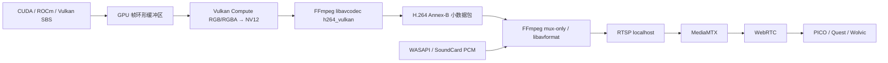

# Desktop2Stereo 网络推流规格书：统一高级网络推流

本文是 Desktop2Stereo 网络推流的统一规格书，定义高级网络推流的共享会话层、GPU/CPU 视频编码后端、GPU 图像路径、音频复用、MediaMTX/WebRTC 发布、自动网络校准、回退策略、可观测性和验收要求。GPU 厂商优先策略已并入高级网络推流，用户只保留一个高级网络推流入口。

目标是消除当前 4K SBS 推流中的 CUDA/ROCm → CPU RGB24 → FFmpeg stdin 路径，让图像在 GPU 内完成 SBS 整理、颜色转换和硬件编码。编码后的 H.264/H.265 小数据包仍通过 FFmpeg/MediaMTX 发布，并由局域网头显浏览器通过 WebRTC 播放。

> 本文同时记录实施设计和当前验收状态。native Vulkan 编码桥已完成独立 4K 编码烟测并接入高级网络推流；本机已完成连续 600 帧 3840×2160@30 发布和 ffprobe 媒体参数验证；SoundCard/WASAPI 连续运行 10.12 秒无 runtime error，MediaMTX 确认 `2 tracks (H264, Opus)`。Vulkan 失败后的 OpenGL NVIDIA CUDA interop → PyNvVideoCodec/NVENC 分支已完成本机 640×360 RTSP 压缩包闭环；头显端持续 4K/30 FPS 实机验收仍需继续完成；Khronos validation 层会触发 FFmpeg 内部 NV12 frame-pool 的已知 VUID 与 flush/idle 阻塞，程序检测到该层后主动进入 OpenGL 探测并按能力回退。

## 目录

- [当前瓶颈](#当前瓶颈)
- [Vulkan 在本方案中的含义](#vulkan-在本方案中的含义)
- [目标数据流](#目标数据流)
- [为什么不能只修改 FFmpeg 命令](#为什么不能只修改-ffmpeg-命令)
- [高级网络推流模式](#高级网络推流模式)
- [平台支持范围](#平台支持范围)
- [模块设计](#模块设计)
- [GPU 图像格式和颜色转换](#gpu-图像格式和颜色转换)
- [同步与缓冲区生命周期](#同步与缓冲区生命周期)
- [FFmpeg Vulkan 编码桥](#ffmpeg-vulkan-编码桥)
- [音频和 MediaMTX](#音频和-mediamtx)
- [能力探测与回退](#能力探测与回退)
- [GUI 和配置建议](#gui-和配置建议)
- [分阶段实施](#分阶段实施)
- [测试与验收](#测试与验收)
- [性能指标](#性能指标)
- [日志规范](#日志规范)
- [常见故障](#常见故障)
- [统一网络推流规格](#统一网络推流规格)
- [实现检查清单](#实现检查清单)

## 当前瓶颈

当前高级推流由 `streaming/direct_sbs.py` 中的 `FfmpegDirectSbsOutput` 完成，主要路径为：

```text
CUDA/ROCm SBS Tensor
        ↓ 下载到 CPU
NumPy RGB24
        ↓ memoryview + stdin 写入
FFmpeg rawvideo 输入
        ↓ RGB24 → YUV420P/NV12
NVENC/AMF/QSV/VideoToolbox 或 CPU 编码
        ↓ RTSP
MediaMTX
        ↓ WebRTC
PICO/Quest/Wolvic 浏览器
```

代码中的关键现状：

- `DirectSbsOutputConsumer` 在输出对象没有 `submit_cuda_frame()` 时调用 `RuntimeSbsRgbConverter`。
- FFmpeg 输入固定为 `-f rawvideo -pixel_format rgb24 -i pipe:0`。
- `_write_frame()` 将整帧通过 Python 子进程 stdin 写入。
- 编码器可以是 NVENC、AMF、QSV、VAAPI 或 VideoToolbox，但输入在进入 FFmpeg 前已经落到 CPU。

4K、48 FPS 的 RGB24 原始数据吞吐约为：

```text
3840 × 2160 × 3 × 48 ≈ 1.19 GB/s
```

这还不包括 CUDA 下载、NumPy 布局转换、Python pipe 复制、FFmpeg RGB→YUV 和再次上传编码器的成本。该路径容易造成提交线程阻塞、帧队列覆盖、FFmpeg 输入不连续和 WebRTC 端卡顿。

## Vulkan 在本方案中的含义

“Vulkan 图像传输”指 GPU 内部图像通路，不是局域网传输协议。

各层职责如下：

| 层 | 技术 | 职责 |
| --- | --- | --- |
| 推理与 SBS 合成 | CUDA、ROCm 或 Vulkan Compute | 生成左右眼 SBS 图像 |
| GPU 图像交换 | Vulkan external memory | 在计算后端和 Vulkan 间共享图像内存 |
| GPU 同步 | Vulkan/CUDA/HIP external timeline semaphore | 保证生产者和编码器不会同时读写同一槽位 |
| 颜色转换 | Vulkan Compute | RGBA/RGB → NV12 或 P010 |
| 视频编码 | FFmpeg `h264_vulkan`/`hevc_vulkan` | 使用 Vulkan Video Encode 生成压缩码流 |
| 本机发布 | RTSP 或 SRT | 将压缩码流交给 MediaMTX |
| 头显播放 | WebRTC | 浏览器接收 H.264/Opus |

局域网头显浏览器不能直接接收 Vulkan 图像。Vulkan 只用于电脑端 GPU 内部处理，网络上仍发送压缩视频。

## 目标数据流



目标路径必须满足：

1. 每帧不创建新的 GPU 图像、内存、信号量或编码上下文。
2. 正常工作时不调用 `.cpu()`、`.numpy()`、`cudaMemcpyDeviceToHost` 或等价操作。
3. 原始 4K 图像不经过 Python pipe。
4. pipe 中只允许传输压缩后的 H.264/H.265 数据包或低带宽音频。
5. 帧落后时丢弃旧帧，不积压高延迟队列。

## 为什么不能只修改 FFmpeg 命令

FFmpeg 的 `h264_vulkan` 编码器只接受 `AV_PIX_FMT_VULKAN` 硬件帧。当前 `pipe:0` 是普通字节流，只能表达 RGB24 等 CPU 图像，不能表达：

- `VkImage`
- `VkDeviceMemory`
- Vulkan device/queue
- 图像布局和 queue-family ownership
- external memory handle
- timeline semaphore 及其计数值

因此下面这种思路不能得到零拷贝路径：

```text
Python RGB24 pipe → FFmpeg hwupload → h264_vulkan
```

它仍然先下载到 CPU，再由 FFmpeg上传到 Vulkan。

真正的 Vulkan 路径需要以下两种实现之一：

1. **推荐：进程内 FFmpeg 编码桥。** C/C++ 原生模块链接 `libavcodec`、`libavutil`，直接向 `h264_vulkan` 提交 `AV_PIX_FMT_VULKAN` 帧。
2. **不建议首期采用：跨进程 GPU IPC。** 自定义 FFmpeg 输入设备，通过 Win32 Handle 或 Linux FD 传递 external memory 和 semaphore。该方案平台差异大、句柄生命周期复杂，还需要维护 FFmpeg 补丁。

首期应选择进程内编码桥，压缩后的码流再交给现有 FFmpeg muxer。

### 2026-08-22 验证结论：不要把 NV12 拆成两个编码输入 image

Windows RTX 3090、NVIDIA Vulkan 驱动 610.88 和项目 FFmpeg 9.0.1 `d2s.2` 的
Validation Layer 实测表明，`h264_vulkan` / `hevc_vulkan` 的 Video Session 要求
输入为单一 `VK_FORMAT_G8_B8R8_2PLANE_420_UNORM` image。为了让 CUDA 导入，FFmpeg
frame pool 设置 `AV_VK_FRAME_FLAG_DISABLE_MULTIPLANE` 后会得到 `R8_UNORM` 与
`R8G8_UNORM` 两个 image；它们可导出 external-memory handle，却不具备
`VK_FORMAT_FEATURE_VIDEO_ENCODE_INPUT_BIT_KHR`，不能作为 Vulkan Video Encode 源。

因此“CUDA 分别写 Y、UV 两个 FFmpeg image，再提交 Vulkan Video”在该驱动上不可用，
必须保持自动回退。FFmpeg 9.0.1 的 `hwcontext_vulkan.h` 进一步明确：
`AV_VK_FRAME_FLAG_DISABLE_MULTIPLANE` 是导出/导入 CUDA image 所需的标志，启用后正是
R8/R8G8 拆分表示；不启用它才能保留单一 NV12 image，但当前 CUDA importer 没有合法的
multi-plane optimal-tiled image 映射接口。因此当前版本选择 Vulkan Compute + device-local
copy，并禁止把两个单 plane image 伪装成 NV12 编码输入。未来若 FFmpeg 提供真正的
multi-plane external-memory CUDA 映射，再切换到 CUDA 直接写入路径。

该结论与官方资料一致：[FFmpeg `hwcontext_vulkan.h`](https://ffmpeg.org/doxygen/7.1/hwcontext__vulkan_8h_source.html) 将 `AV_VK_FRAME_FLAG_DISABLE_MULTIPLANE` 标为 CUDA 导入所需；FFmpeg 的 CUDA 映射代码明确报告当前不能把 multi-plane Vulkan image 映射到 CUDA，并要求 `disable_multiplane=1`；[NVIDIA CUDA Vulkan interoperability](https://docs.nvidia.com/cuda/cuda-programming-guide/04-special-topics/graphics-interop.html) 说明 external memory/semaphore 可共享，但不提供该 multi-plane 视频图像限制的绕过方式。

## 高级网络推流模式

加入 Vulkan 和厂商 GPU 编码后，GPU 推流不再是独立运行模式。它作为高级网络推流的自动后端策略：能力探测优先选择可用的 NVIDIA、AMD 或 Intel GPU 编码路径，失败后回退 Vulkan、平台 FFmpeg 硬件编码或 CPU。网络会话、MediaMTX/音频复用、编码包发布、生命周期回收和 WebRTC 自动校准均只有一套实现。

Intel Windows 的高级网络推流已完成原生 GPU 共享路径：

```text
Vulkan packed SBS image pass
    -> D3D11-owned shared BGRA8 texture
    -> Vulkan/D3D11 Adapter LUID 校验与 producer 同步
    -> D3D11 VideoProcessor BGRA8 -> NV12
    -> oneVPL/QSV D3D11 surface
    -> H.264/H.265 -> MediaMTX/WebRTC
```

该路径不经过 CPU RGB stdin，也不再经过左右眼中间图像 blit；运行时使用同一 D3D11 设备和 Adapter LUID，并记录 `gpu_to_cpu=False`、`gpu_copy_count=0`、`zero_copy=True`。如果 Vulkan/D3D11 句柄、同步、格式、LUID、oneVPL 或驱动能力探测失败，只允许熔断到 Intel QSV/D3D11 或 CPU host-upload，并记录真实回退边界。Desktop Duplication 到 OpenVINO 的 GPU 纹理输入也已接通；当前深度结果 ABI 仍是 CPU 张量，因此 `native_depth_input_zero_copy=True` 与 `native_depth_zero_copy=False` 必须分开记录。

推荐回退顺序：

```text
高级推流 Auto
├─ Windows/Linux：h264_vulkan / hevc_vulkan
├─ OpenGL GPU fallback：CUDA–OpenGL → NVENC；PBO → 厂商/CPU
├─ Windows：NVENC → QSV → AMF
├─ Windows + Intel：Vulkan packed SBS → D3D11 shared BGRA/NV12 → oneVPL/QSV
├─ Linux：QSV → VAAPI
├─ macOS：VideoToolbox
└─ libx264 / libx265

高级网络推流 Auto
├─ NVIDIA：PyNvVideoCodec/NVENC 或 Vulkan/OpenGL fallback
├─ AMD：HIP → D3D11 → AMF 或 Vulkan/OpenGL fallback
├─ Intel：D3D11/oneVPL/QSV 或 Vulkan/FFmpeg fallback
└─ CPU：libx264 / libx265
```

### OpenGL 备用图像路径

OpenGL 只作为 Vulkan 图像路径的备用后端，不是网络协议，也不是通用视频编码器。浏览器端仍然接收 `H.264/Opus → MediaMTX → WebRTC`。OpenGL 负责提供 RGBA texture/FBO，最终必须交给厂商编码器或现有 host-upload FFmpeg 路径：

```text
Vulkan 失败
    ↓
OpenGL headless context（WGL/EGL/GLX）
    ↓
RGBA texture/FBO + 3 槽 PBO/fence
    ├─ NVIDIA：CUDA–OpenGL interop → NVENC/PyNvVideoCodec
    ├─ AMD：HIP–OpenGL interop → AMF；失败时 PBO/FFmpeg
    ├─ Intel：Vulkan packed SBS → D3D11 VideoProcessor → oneVPL/QSV；失败时 CPU RGB → QSV/VAAPI
    └─ 无 GPU interop：OpenGL 能力探测通过 → 现有 host-upload FFmpeg
    ↓
压缩 H.264/H.265 → FFmpeg mux-only → MediaMTX/WebRTC
```

OpenGL 路径的能力探测必须验证实际 context、纹理格式、PBO/fence、CUDA–OpenGL interop、厂商编码器和目标分辨率，不能仅凭 `OpenGL` 字符串或显卡名称选择。当前代码已实现三级能力探测：NVIDIA 且 CUDA graphics interop 成功时，CUDA RGBA tensor 通过 `cudaGraphicsGLRegisterImage` 映射 OpenGL RGBA8 texture，再通过 CUDA device-to-device copy 返回 CUDA RGBA tensor，交给 PyNvVideoCodec/NVENC 和现有压缩包 muxer。[PyNvVideoCodec 官方 GPU 编码接口](https://docs.nvidia.com/video-technologies/pynvvideocodec/pynvc-api-prog-guide/using_pynvvideocodec_apis.html)要求 NV12 每个 plane 提供 CUDA Array Interface 的设备指针，并没有接收 `cudaArray_t` 或 OpenGL texture handle 的 Python 接口；因此当前路径不能把已映射的 OpenGL array 直接交给 PyNvVideoCodec，严格 zero-copy 需要新增原生 Video Codec SDK `NV_ENC_INPUT_RESOURCE_TYPE_CUDAARRAY` bridge。ROCm/HIP 环境使用同一 graphics-resource ABI 映射 OpenGL texture，并交给已有 AMF surface 编码器；这两条 GPU 图像链路都记录 `gpu_to_cpu=False`，但由于 GPU linear memory 与 OpenGL array 之间存在 GPU copy，仍记录 `zero_copy=False`。没有 CUDA/HIP interop、使用 Intel/macOS、输入本身已经是 CPU RGB，或互操作探针失败时，先完成 OpenGL context/纹理/PBO/fence 能力探测，再直接回退现有 host-upload，明确记录 `interop=none gpu_to_cpu=True` 和 `host-upload fallback`；CPU/非 CUDA 帧通过 `VulkanDirectSbsOutput.submit_frame()` 进入同一回退边界，不会错误调用 Vulkan rawvideo 编码命令；由于此时原始帧已经在 CPU，不能再把它上传 OpenGL 后读回，否则只会增加无意义的 CPU↔GPU 往返。当前项目没有把 OpenGL texture 伪装成 QSV/VAAPI surface，也没有把它伪装成 VideoToolbox 的 IOSurface-backed `CVPixelBuffer`；这些需要各平台原生硬件帧和进程内编码桥，不能由 FFmpeg rawvideo stdin 实现。OpenGL 路径发生运行时错误后熔断本次会话并回退 host-upload，避免 Vulkan/OpenGL 之间来回抖动。

## 平台支持范围

| 平台 | Vulkan 图像路径 | Vulkan Video 编码 | OpenGL 备用路径 | 默认策略 |
| --- | --- | --- | --- | --- |
| Windows + NVIDIA | CUDA external memory/semaphore | 支持时启用 | CUDA–OpenGL interop → NVENC | 首个实施与验收目标 |
| Linux + NVIDIA | CUDA external memory/semaphore FD | 支持时启用 | EGL/GLX + CUDA interop → NVENC | 第二阶段 |
| Windows + AMD | HIP/Vulkan 或 Vulkan Compute | 驱动支持时启用 | HIP–OpenGL interop → AMF；失败时 PBO/host | 保留 AMF 回退 |
| Linux + AMD | ROCm/Vulkan 或 Vulkan Compute | 驱动支持时启用 | EGL/PBO → VAAPI/AMF | 保留 VAAPI 回退 |
| Windows/Linux + Intel | Vulkan Compute/Vulkan image；Windows packed SBS → D3D11 shared BGRA | Windows oneVPL/QSV 已接入，Linux 按 VAAPI/QSV 能力探测 | Vulkan/D3D11 native path；失败时 CPU RGB → QSV/VAAPI | Intel 原生 GPU 路径优先，保留 QSV/VAAPI 回退 |
| macOS | 不作为通用 Vulkan Video 目标 | 不强制 | OpenGL 能力探测 → CPU RGB → VideoToolbox | 使用 VideoToolbox |

不能只检查显卡名称。运行时必须查询 Vulkan 扩展、视频队列、编码 Profile 和输入格式。

最低能力集合：

```text
VK_KHR_video_queue
VK_KHR_video_encode_queue
VK_KHR_video_encode_h264 或 VK_KHR_video_encode_h265
支持 VK_QUEUE_VIDEO_ENCODE_BIT_KHR 的 queue family
支持目标分辨率、Profile、Level 和输入格式
```

CUDA/ROCm 共享路径还需要对应的 external memory 和 external semaphore 扩展。在 Windows 使用 Win32 Handle，在 Linux 使用 FD。

## 模块设计

### 建议新增文件

```text
src/desktop2stereo/streaming/
├─ vulkan_encoder.py
├─ vulkan_capabilities.py
├─ opengl_capabilities.py
├─ opengl_stream_backend.py
├─ encoded_packet_muxer.py
└─ native/
   └─ vulkan_ffmpeg_bridge/
      ├─ CMakeLists.txt
      ├─ bindings.cpp
      ├─ vulkan_frame_pool.cpp
      ├─ vulkan_color_convert.cpp
      ├─ ffmpeg_vulkan_encoder.cpp
      └─ include/
```

现有文件的修改范围：

| 文件 | 修改内容 |
| --- | --- |
| `streaming/direct_sbs.py` | 增加 `VulkanDirectSbsOutput`，复用服务器、码率、音频和关闭逻辑 |
| `streaming/nvidia_encoder.py` | 将压缩包 mux 部分抽成通用 `EncodedPacketMuxer` |
| `app_runtime/runtime_output.py` | 抽取 CUDA/ROCm→Vulkan 外部内存和信号量公共能力 |
| `viewer/vulkan_resources.py` | 复用句柄、内存类型和信号量工具；不要复用只适合 RGBA 展示的图像配置 |
| `gui/builders.py` | 后端选择增加 `Vulkan Video` |
| `gui/config_mgr.py` | 保存、加载并校验新后端值 |
| `streaming/rtmp/runtime-manifest.json` | 声明 FFmpeg Vulkan 编码和共享库能力 |

### Python 层接口

建议的 Python 包装接口：

```python
class VulkanVideoEncoder:
    def probe(self, *, codec: str, width: int, height: int) -> CapabilityReport: ...
    def open(self, *, width: int, height: int, fps: int,
             bitrate: int, peak_bitrate: int, codec: str) -> None: ...
    def submit_cuda(self, tensor, *, pts: int, force_idr: bool = False) -> None: ...
    def submit_vulkan(self, image, ready_semaphore, ready_value,
                      *, pts: int, force_idr: bool = False) -> None: ...
    def read_packets(self) -> list[bytes]: ...
    def flush(self) -> list[bytes]: ...
    def close(self) -> None: ...
```

`VulkanDirectSbsOutput` 实现 `submit_cuda_frame()`。这样 `DirectSbsOutputConsumer` 会跳过 `RuntimeSbsRgbConverter`，直接把 CUDA/ROCm Tensor 交给 Vulkan 路径。

### 原生桥职责

原生桥必须负责：

1. 创建或接管 Vulkan instance、physical device、device 和 video queue。
2. 创建固定大小的 NV12/P010 编码输入帧池。
3. 导入 CUDA/HIP 外部内存，或接受已有 `VulkanImageResource`。
4. 执行 GPU 颜色转换和图像布局转换。
5. 构造 `AVHWDeviceContext`、`AVHWFramesContext` 和 `AVFrame`。
6. 调用 `avcodec_send_frame()` / `avcodec_receive_packet()`。
7. 将压缩包复制为小型 CPU bytes 返回；不返回原始图像。
8. 在 close/异常路径正确等待和释放 GPU 对象。

Python 层不应直接管理裸 `VkImage` 或 `AVFrame` 生命周期。

## GPU 图像格式和颜色转换

### 不要以 RGB24 作为 Vulkan 编码输入

视频编码器通常需要 NV12 或 P010。推荐格式：

| 视频 | 输入格式 | 位深 | 用途 |
| --- | --- | --- | --- |
| H.264 | NV12 | 8 bit | WebRTC 浏览器兼容性优先 |
| H.265 | NV12 | 8 bit | Full-SBS 或明确支持 HEVC 的客户端 |
| H.265 HDR | P010 | 10 bit | 后续扩展，不作为首期目标 |

首期采用 H.264 + NV12 + BT.709 limited range。

### GPU 颜色转换

推荐使用 Vulkan Compute Shader 一次完成：

1. 读取 SBS RGBA/RGB 图像。
2. 按 BT.709 将 RGB 转换为 YUV。
3. 写入全分辨率 Y 平面。
4. 对 2×2 像素块进行色度采样，写入交错 UV 平面。
5. 对齐编码器报告的 `encodeInputPictureGranularity`。

必须在能力探测后调用 `vkGetPhysicalDeviceVideoFormatPropertiesKHR`，根据视频 Profile 查询真正支持 `VK_IMAGE_USAGE_VIDEO_ENCODE_SRC_BIT_KHR` 的格式。不能写死某个多平面 Vulkan Format 后假设所有驱动都支持。

色彩参数必须随帧或编码上下文明确设置：

```text
color_primaries = BT.709
color_trc       = BT.709
colorspace      = BT.709
color_range     = limited
chroma_location = left
```

错误的矩阵或范围会导致头显端发灰、黑位抬升、颜色偏绿或过饱和。

## 同步与缓冲区生命周期

### 使用固定环形缓冲区

沿用现有 Vulkan Viewer 的思路，默认使用 3 个槽位：

```text
slot 0：编码器读取
slot 1：颜色转换写入
slot 2：等待下一帧
```

每个槽位至少包含：

- SBS 源图像引用或导入句柄
- NV12/P010 编码输入图像
- producer-ready timeline semaphore/value
- encoder-release timeline semaphore/value
- 对应 `AVFrame` 或硬件帧引用
- PTS 和帧编号

### 正确的同步顺序

```text
生产者等待 encoder-release(N)
生产者写入/转换 slot N
生产者 signal producer-ready(N)
编码队列 wait producer-ready(N)
编码器读取 slot N
编码完成 signal encoder-release(N)
槽位才允许复用
```

注意事项：

- 不允许仅依赖 Python 对象仍然存活来判断 GPU 已经用完图像。
- 不要每帧调用 `vkDeviceWaitIdle()`、`cudaDeviceSynchronize()` 或 `torch.cuda.synchronize()`。
- 首帧、重建编码器和退出时可以进行有限的全局等待。
- 队列落后时跳过未提交的旧帧，绝不能复用仍被编码器引用的槽位。
- Vulkan 图像在编码前必须转换到 `VK_IMAGE_LAYOUT_VIDEO_ENCODE_SRC_KHR`。
- compute queue 和 video encode queue 不同时，需要正确执行 queue-family ownership transfer。

## FFmpeg Vulkan 编码桥

### FFmpeg 构建要求

FFmpeg 不得从 gyan.dev、johnvansickle.com、evermeet.cx 或其他第三方二进制站点下载预编译包。正式运行时必须以 FFmpeg 官方源码构建；官方入口为 [FFmpeg Download](https://ffmpeg.org/download.html)，源码可从 [FFmpeg Git 仓库](https://git.ffmpeg.org/ffmpeg.git) 或官方 release tarball 获取。构建 commit/tag、配置参数、编译器、依赖版本和 SHA-256 必须写入 `runtime-manifest.json`。

每个平台在对应 GitHub Actions runner 上从官方源码独立编译，不使用交叉编译结果冒充平台验证。构建产物不能只包含 `ffmpeg.exe`，Vulkan 原生桥还需要：

```text
ffmpeg/bin/ffmpeg[.exe]
ffmpeg/bin/ffprobe[.exe]
ffmpeg/bin/avcodec-*.dll 等共享库（Windows）
ffmpeg/lib/libavcodec.* 等共享库（Linux/macOS）
ffmpeg/include/libavcodec/
ffmpeg/include/libavutil/
ffmpeg/include/libavformat/
ffmpeg/lib/pkgconfig/
```

FFmpeg 配置至少包含：

```text
--enable-vulkan
--enable-shared
--enable-libopus
--enable-libsrt
--enable-gpl
--enable-libx264
--enable-libx265
```

公开 Release 继续禁止 `--enable-nonfree`。`--enable-cuda-nvcc`、`--enable-nvenc` 等硬件选项只有在对应 SDK、许可证和 runner 条件满足时才启用；不能为了得到某个编码器而下载或提交不可审计的第三方二进制。

建议的源码构建边界如下：

```text
官方 FFmpeg 源码/tag
    -> 平台 runner 安装已锁定的 Vulkan、x264/x265、Opus、SRT 开发依赖
    -> configure / cmake + 编译
    -> ffmpeg、ffprobe、shared libraries、headers、pkg-config
    -> ABI/encoder probe + SHA-256 manifest
    -> 下载到 streaming/rtmp/ffmpeg/<platform>/
```

Windows、Linux 和 macOS 必须分别生成本平台二进制；本地只下载 CI 已验证的项目构建 artifact，不在用户机器上临时下载第三方 FFmpeg 包。日常 Python/GUI 修改不触发 FFmpeg 重编译，只有 FFmpeg tag、配置、补丁、依赖或原生编码桥 ABI 变化时才重新构建。

构建验证必须出现：

```text
ffmpeg -encoders | findstr /i "h264_vulkan hevc_vulkan"
```

Linux/macOS 将 `findstr` 换成 `grep -E`。

### 串流运行时下载、目录与校验

网络串流运行时目录统一为 `streaming/rtmp/`：

```text
streaming/rtmp/
├── ffmpeg/<platform>/bin/ffmpeg[.exe]
├── ffmpeg/<platform>/bin/ffprobe[.exe]
├── ffmpeg/<platform>/lib/             # shared libraries
├── ffmpeg/<platform>/include/        # native bridge headers
├── mediamtx/mediamtx[.exe]
├── mediamtx/mediamtx.yml              # official template, read-only source
├── mediamtx.yml                       # project final configuration
└── runtime-manifest.json
```

MediaMTX 仍从其官方发布页获取对应平台压缩包：[MediaMTX Releases](https://github.com/bluenviron/mediamtx/releases/latest)。支持 Windows x64、Linux x64/ARM64、macOS Intel/Apple Silicon；不得混用不同操作系统或架构的文件。MediaMTX 官方模板只在根目录 `mediamtx.yml` 不存在时复制一次，升级不得覆盖项目配置。

FFmpeg 的下载对象不是官方预编译包，而是官方源码/tag 和本项目 GitHub Actions 产物。项目可提供 `python scripts/download_streaming_runtime.py --system <Windows|Linux|Darwin>`，但该脚本只能下载经过 manifest/SHA-256 校验的本项目 FFmpeg 构建 artifact 和 MediaMTX 官方发布包，不得访问第三方 FFmpeg 二进制地址。

可通过环境变量覆盖安装位置：

- `D2S_STREAMING_RUNTIME_DIR`：运行时根目录。
- `D2S_FFMPEG_PATH`：直接指定已校验的项目自编译 FFmpeg。
- `D2S_MEDIAMTX_PATH`：直接指定 MediaMTX。
- `D2S_MEDIAMTX_CONFIG`：直接指定 MediaMTX 配置。

启动时必须按 `runtime-manifest.json` 检查操作系统、架构、FFmpeg 源码 commit/tag、构建配置、ABI、编码器能力和 SHA-256；缺少或不匹配时报告原因并进入稳定回退，不得静默使用系统中未知来源的 `ffmpeg`。平台音频输入保持：Windows `dshow`，Linux PulseAudio，macOS `avfoundation`；macOS 音频设备值使用 FFmpeg 设备索引。

`ffmpeg/rtmp.bat` 不是运行时依赖。当前 FFmpeg 参数由 `src/desktop2stereo/streaming/direct_sbs.py` 统一生成，跨平台运行不会调用该旧脚本。MediaMTX 自定义端口通过 `MTX_*ADDRESS` 环境变量传递；`hlsSegmentMaxSize: 256M` 等兼容项保留在最终根配置中，升级时只合并模板差异，不把完整模板复制到 `settings.yaml`。

### 编码参数

低延迟 WebRTC 起始参数：

```text
codec       = H.264
profile     = High（若头显兼容性有问题回退 Main）
pixel_fmt   = AV_PIX_FMT_VULKAN
sw_format   = NV12
fps         = 自动校准结果，默认不高于客户端稳定值
gop         = fps
bf          = 0
refs        = 1
rate mode   = VBR 或驱动低延迟模式
bitrate     = 自动校准 target
maxrate     = 自动校准 peak
forced IDR  = 启动、重连、客户端请求恢复时
```

FFmpeg 的 H.264 Vulkan 编码器默认可能允许 B 帧，低延迟模式必须显式设 `bf=0`，不能依赖默认值。

### 压缩包输出

原生桥返回 H.264 Annex-B 数据包后，复用现有 PyNvVideoCodec 路径中的“编码包 → FFmpeg mux”思路：

```text
VulkanVideoEncoder packet
    ↓ 少量 pipe 写入
FFmpeg -f h264 -i pipe:0 -c:v copy
    ↓ 加入 Opus 音频并封装
RTSP localhost → MediaMTX
```

此处 pipe 数据量已经从约 1.2 GB/s 降到几十 Mb/s，不再是主要瓶颈。后续如需进一步减少进程和复制，再把 mux 改为进程内 `libavformat`。

## 音频和 MediaMTX

Vulkan 只替换视频图像和编码路径，不改动音频采集原则：

- Windows 使用已经单独验证的 SoundCard/WASAPI loopback。
- 音频编码为 Opus 48 kHz。
- 音频线程短暂异常时继续静音并重试，不能直接终止视频发布。
- 保留音频延迟校准参数。

发布链建议继续使用：

```text
编码包 + Opus → FFmpeg mux-only → RTSP/TCP localhost → MediaMTX → WebRTC/UDP LAN
```

本机 FFmpeg 到 MediaMTX 的 RTSP 使用 TCP，可以避免本地 UDP RTP 包长和丢包问题。头显端最终仍由 MediaMTX 使用 WebRTC。

SRT 适合服务间或原生客户端传输，但浏览器不能直接播放 SRT，因此不能替代头显端 WebRTC。

## 能力探测与回退

### 启动探测顺序

1. 检查 FFmpeg 共享库版本与构建清单一致。
2. 检查 `h264_vulkan`/`hevc_vulkan` 是否存在。
3. 枚举 Vulkan physical device，并与计算 Tensor 所在 GPU 的 UUID/LUID 匹配。
4. 检查 H.264/H.265 encode 扩展。
5. 查找带 `VK_QUEUE_VIDEO_ENCODE_BIT_KHR` 的 queue family。
6. 查询目标 Profile、Level、分辨率和 NV12/P010 格式。
7. 创建 1 秒合成图编码探针。
8. 探针成功后才选择 Vulkan 路径。
9. Vulkan 初始化或探针失败时，探测 OpenGL headless context、RGBA8 texture、PBO/fence 和厂商编码器。
10. 只有 OpenGL 图像提交与编码探针都成功，才选择 OpenGL fallback；否则进入现有 host-upload 路径。

只运行 `ffmpeg -encoders` 不够，它只能证明编译能力，不能证明当前驱动和设备能运行。

部分 NVIDIA 驱动虽然已经暴露 Vulkan H.264 Encode profile，但 FFmpeg 在未指定 profile 时仍可能报告：

```text
No supported profiles for given format
```

此时应按构建指南的 `format=nv12,hwupload` 真机命令执行探针，并显式指定 `-profile:v high`；3840×2160 H.264 同时使用 `-level:v 5.1`，HEVC 使用 `-profile:v main`。本项目的探针和 Vulkan 编码命令都显式设置 profile，只有探针成功才启用该路径。当前 NVIDIA profile 的宽高上限为 4096；3840×2160 Half-SBS 可以验证，7680×2160 Full-SBS 不能直接使用该 H.264 Vulkan profile。

### 设备必须匹配

CUDA Device 0 不一定对应 Vulkan 枚举中的 Physical Device 0。必须通过以下标识匹配同一张显卡：

- Windows：LUID 或 device UUID
- Linux：PCI bus/device/function 或 device UUID

如果计算和 Vulkan 选择了不同 GPU，external memory 导入会失败，或被迫经过主机复制。

### 回退规则

当前原生桥 ABI v5 已固定在 `native/vulkan_ffmpeg_bridge/`：默认由 FFmpeg 创建带 Vulkan Video 扩展的逻辑 device、单 plane RGBA 输入池和单一 NV12 multi-plane 编码池。`VulkanDirectSbsOutput` 已通过 `CudaVulkanImageImporter` 将 CUDA RGBA 写入 FFmpeg-owned image，在 native Vulkan Compute 中完成 RGBA→R8/RG8→NV12，再将 H.264/H.265 压缩包交给 FFmpeg mux-only 管线发布；正常路径不下载到 CPU，也不通过 stdin 传输 4K 原始帧。native bridge 启动时查询目标 NV12 multi-plane image 是否支持 `STORAGE_IMAGE`。支持时，Vulkan Compute 直接通过 plane view 写入编码图像，日志标记 `gpu_to_cpu=False`、`gpu_copy=False`、`zero_copy=True`；不支持时自动使用固定槽位的 R8/RG8 中间图像和一次 device-local copy，日志标记 `gpu_copy=True`、`zero_copy=False`。两种路径都不下载 CPU，也不通过 stdin 传输 4K 原始帧。native bridge、CUDA 导入、编码或 packet mux 任一环节失败时，输出对象只记录一次原因并自动回退现有稳定 host-upload 高级推流。

已完成的本机证据：RTX 3090 + FFmpeg 9.0.1 `d2s.2` 下，独立 native smoke 已通过 640×360 和 3840×2160 H.264 编码并读取压缩包；2026-08-22 将 RGB→NV12 Compute 中间资源改为按 FFmpeg NV12 输出 image 建立的固定槽环（每槽独立 Y/UV storage image、descriptor set、command buffer 和 fence），不再所有帧共享一套转换资源；远程构建 DLL 重新下载后，UUID 探针确认 Vulkan/NVIDIA 与 CUDA `cuda:0` UUID 一致；修正 Windows GBK 日志编码后，4K 3840×2160@30 连续提交 60 帧耗时 0.94 秒（63.9 FPS），MediaMTX 确认 H.264 在线发布且关闭正常；`VulkanDirectSbsOutput` 已真实启动 MediaMTX，连续提交 30 帧 3840×2160@30，MediaMTX 日志确认 `1 track (H264)` 在线并 publishing，提交吞吐约 41 FPS；native DLL 缺失时已实测自动回退 NVENC host-upload。Python 契约/互操作/推流测试通过，PTS 已改为单调帧序号；修复 drain ABI 后，使用远程构建 run `32534594122` 的 Windows DLL 完成 3840×2160 H.264 连续 900 帧 soak（30 FPS 配置，实际提交 126.03 FPS，900 个压缩包、总计 9.15 MB），flush 正常结束。Vulkan validation 层在当前 queue-family handoff 的 flush 等待阶段仍会挂起，并保留 FFmpeg frame-pool 的 `VUID-VkImageCreateInfo-pNext-06811` 告警；这不影响当前普通驱动路径烟测，但头显端持续 4K/30 FPS 解码和 validation 清零仍是未完成验收项。

直接 NV12 storage 分支已在远程 MinGW 构建和本机 RTX 3090 实测：GitHub Actions run `32532407231` 构建成功；NVIDIA 驱动对 `VK_FORMAT_G8_B8R8_2PLANE_420_UNORM` 与 `STORAGE_IMAGE | VIDEO_ENCODE_SRC | TRANSFER_DST` 的查询返回 `VK_ERROR_FORMAT_NOT_SUPPORTED (-11)`，程序因此明确选择 `gpu_copy=True zero_copy=False` 的固定槽位路径；3 次 3840×2160 H.264 RGBA→NV12→压缩包烟测均通过。该结果说明当前 NVIDIA 目标驱动不能对编码 NV12 直接执行 storage image 写入，不能把本机路径误报为严格 zero-copy。

原生桥通过 `.github/workflows/vulkan-ffmpeg-bridge.yml` 在 GitHub Actions Windows Runner 远程构建；本地不要求安装 C++ 工具链、Vulkan SDK 或 FFmpeg 开发包。

新增 `src/desktop2stereo/tools/vulkan_ffmpeg_rtsp_soak.py` 用于验证压缩包进入发布端：工具启动 MediaMTX，启动 FFmpeg `-c:v copy` mux-only RTSP/TCP 发布，只向 stdin 写 H.264 压缩包，不写入 4K rawvideo。RTX 3090 本机使用 run `32534594122` DLL 实测 640×360@30 运行 5 秒（150/150 帧）和 3840×2160@30 运行 10 秒（300/300 帧）均通过，FFmpeg 与 MediaMTX 未中途退出。

任何 Vulkan 初始化、导入、编码或连续提交失败都应：

1. 停止接收新 Vulkan 帧。
2. flush 并关闭编码器。
3. 等待所有槽位释放。
4. 记录一次完整失败原因。
5. 回退当前平台的 FFmpeg 厂商硬件编码。
6. 厂商硬件编码也失败时再回退 CPU。

不要在每一帧重复探测 Vulkan，也不要在失败循环中不断创建编码器。

## GUI 和配置建议

高级网络推流的“视频编码后端”建议调整为：

```text
Auto（推荐）
Vulkan Video
FFmpeg 硬件编码
FFmpeg 软件编码
```

高级网络推流的编码器选择保留：

```text
Auto（推荐，按能力优先 GPU 后端）
PyNvVideoCodec（NVIDIA）
Vulkan Video
Intel QSV/D3D11
FFmpeg 硬件编码
FFmpeg 软件编码
```

建议配置字段：

```yaml
Stream Video Backend: auto
Vulkan Video Codec: h264
Vulkan Frame Ring Size: 3
Vulkan Allow Host Fallback: false
Vulkan Probe Timeout Seconds: 8
```

行为要求：

- `Auto`：探测 Vulkan，失败时自动回退并继续推流。
- `Vulkan Video`：探测失败时向 GUI 显示明确错误，但仍提供“一键回退到 Auto”。
- `Vulkan Allow Host Fallback` 默认关闭；否则“Vulkan 已启用”可能实际仍在 CPU 上传，掩盖性能问题。
- GUI 状态栏显示真实活动路径，不只显示用户选择值。

示例状态：

```text
高级推流：Vulkan Video / H.264 / NV12 / 3840×2160@30 / 38 Mbps
```

## 分阶段实施

### 阶段 0：统一 FFmpeg 构建

1. 完成文档 15 的 GitHub Actions 远程构建。
2. Windows/Linux 包启用 Vulkan、H.264/HEVC Vulkan 编码器。
3. 产物增加 FFmpeg 共享库、头文件和 pkg-config 文件。
4. CI 检查 `h264_vulkan` 和 `hevc_vulkan`。
5. 在 RTX 3090 真机执行 Vulkan 合成源编码测试。

### 阶段 1：独立原生编码探针

1. ~~建立 `vulkan_ffmpeg_bridge`。~~ 已完成。
2. ~~建立 FFmpeg-owned Vulkan RGBA/NV12 frame pool 和 GPU frame descriptor ABI。~~ 已完成 ABI v5，包含 external memory/timeline descriptor、RGBA 输入和 `encode_rgba_frame`。
3. ~~不接 Desktop2Stereo，使用 CUDA RGBA + native Vulkan Compute 完成独立编码烟测。~~ 已通过 640×360 和 3840×2160 单帧闭环。
4. ~~接入 `VulkanDirectSbsOutput` 的压缩包 mux-only 管线和自动 host fallback。~~ 已完成代码接入，尚需头显端实机验收。
5. 在 RTX 3090 上持续编码 4K 30 FPS，并完成 queue-family ownership validation 修复。
6. 用 ffprobe 检查时间戳、关键帧和码流，并验证创建、flush、重建和关闭不泄漏资源。

在接入任何 CUDA 帧之前，先用以下独立测试验证远程构建 DLL 与目标驱动：

```text
set D2S_VULKAN_FFMPEG_BRIDGE=<d2s_vulkan_ffmpeg_bridge.dll>
src/python3/python.exe src/desktop2stereo/tools/vulkan_ffmpeg_bridge_smoke.py --ffmpeg-bin <ffmpeg/bin>
```

该测试只创建 FFmpeg-owned Vulkan Video device 和 4K NV12 frame pool、领取一个 frame descriptor 后释放；它不会提交像素，也不会把未同步帧送入编码器。

### 阶段 2：CUDA → Vulkan GPU 通路

1. 复用现有 `CudaVulkanImageImporter` 的 external memory/semaphore 机制。
2. 新建编码专用图像池，不直接拿 Viewer RGBA image 当编码输入。
3. CUDA SBS 写入共享 RGBA 图像。
4. Vulkan Compute 转换为编码器支持的 NV12 图像。
5. Nsight/日志确认没有 Device→Host 图像复制。

### 阶段 3：接入高级推流

1. 新增 `VulkanDirectSbsOutput.submit_cuda_frame()`。
2. 接入 latest-frame 丢帧语义。
3. 抽取并复用 `EncodedPacketMuxer`。
4. 接回 SoundCard/WASAPI + Opus。
5. 接回 MediaMTX/WebRTC。
6. 实现运行中故障回退。

### 阶段 4：AMD、Intel、Linux

1. 用同一 CapabilityReport 验证各平台。
2. AMD 优先复用 ROCm/Vulkan interop；不可用时从 Vulkan Compute 输出接入。
3. Intel 从 Vulkan Compute 或共享 Vulkan image 接入。
4. 保留 AMF、QSV、VAAPI 回退。
5. macOS 继续使用 VideoToolbox，不等待 Vulkan Video。

## OpenGL fallback smoke 工具

可在目标平台从仓库根目录或任意工作目录运行以下命令验证 headless OpenGL、RGBA8 texture、PBO/fence 环和可用的 CUDA/HIP interop；工具会自动定位 `src/desktop2stereo`，不要求预先设置 `PYTHONPATH`：

```powershell
src/python3/python.exe src/desktop2stereo/tools/opengl_fallback_smoke.py --width 640 --height 360 --frames 30
```

工具输出 JSON，至少包含 `context_api`、`texture_format`、`framebuffer_supported`、`pbo_count`、`fence_supported`、`interop_mode`、`gpu_to_cpu`、`gpu_copy_count` 和 `zero_copy`。NVIDIA/AMD interop 可用时运行 GPU probe；其他平台运行 PBO/fence host probe。使用 `--require-gpu-interop` 可将没有 CUDA/HIP interop 的平台作为能力探测失败返回，不会误报为零复制；使用 `--force-host` 可在 NVIDIA/AMD 机器上强制验证 PBO/fence host-upload 分支。

当前 Windows RTX 3090、OpenGL 3.3、WGL 实测同一 3840×2160、30 帧条件：CUDA/OpenGL interop GPU probe 为 `501.1 FPS`，`gpu_to_cpu=false`；强制 host/PBO probe 为 `12.9 FPS`，`gpu_to_cpu=true`。该数据只衡量图像提交边界，不代表最终 NVENC/MediaMTX/WebRTC 帧率；最终验收仍需使用完整高级网络推流和头显浏览器闭环。

## OpenGL fallback MediaMTX 闭环工具

要验证“Vulkan 失败后确实进入 OpenGL fallback，并且压缩视频仍能发布到 MediaMTX”，运行：

```powershell
$env:PYTHONPATH = "src/desktop2stereo"
src/python3/python.exe src/desktop2stereo/tools/opengl_fallback_rtsp_soak.py `
  --width 640 --height 360 --fps 30 --frames 60
```

该工具会在本次进程中将 `VulkanDirectSbsOutput._native_vulkan_bridge` 置空，随后提交 CUDA RGBA 帧并调用真实的 fallback 选择、编码器和 MediaMTX 发布逻辑。成功条件是输出 `opengl_fallback_rtsp_soak: PASS`，并报告 `path=cuda-opengl-interop`、`path=hip-opengl-interop` 或 `path=host-upload`。当前 Windows RTX 3090 实测 3840×2160@30 连续 60 帧通过，实际路径为 `cuda-opengl-interop → PyNvVideoCodec/NVENC → MediaMTX H264`，优化 staging buffer 后耗时 2.08 秒（此前 2.44 秒）；这证明 OpenGL fallback 已越过 4K 图像、编码和本机发布边界，但尚不等同于头显 WebRTC 长时间验收。它只禁用 native Vulkan 入口，不修改生产代码或全局配置；因此可以与 `vulkan_ffmpeg_rtsp_soak.py` 对照定位问题在 Vulkan 图像路径还是 OpenGL/编码/MediaMTX 路径。

使用 `--force-host` 会设置仅用于诊断的 `D2S_OPENGL_FORCE_HOST=1`，跳过 CUDA/HIP graphics interop 探测，但仍创建真实 OpenGL context、RGBA8 texture、PBO/fence，并强制进入 CPU RGB → FFmpeg 厂商/软件编码回退。使用 `--cpu` 可在没有 CUDA 的平台提交真实 CPU RGB 帧，验证 `submit_frame()` → OpenGL 能力探测 → host-upload → MediaMTX 的完整链路；该参数用于诊断，不是正常生产配置。

在 NVIDIA 主机上建议追加 3840×2160、30 FPS、至少 300 帧的测试：

```powershell
src/python3/python.exe src/desktop2stereo/tools/opengl_fallback_rtsp_soak.py `
  --width 3840 --height 2160 --fps 30 --frames 300
```

本机 RTX 3090 实测：640×360@30、60/60 帧和 3840×2160@30、300/300 帧均输出 `PASS`；日志确认 `cuda-opengl-interop`、`PyNvVideoCodec h264 GPU path active`、MediaMTX `1 track (H264)` 在线发布。强制 host 分支另完成 640×360@30、60/60 帧闭环，日志确认 `interop=none`、`gpu_to_cpu=True` 和 FFmpeg host-upload 编码路径；3840×2160@30、60/60 帧也能发布成功，但耗时 5.56 秒，约 10.8 FPS，证明该回退在 4K 下不能满足 30 FPS。该工具的 `PASS` 只证明发送端编码和 MediaMTX 发布边界；头显浏览器的解码帧率、丢帧、花屏和音画同步仍必须用实际 PICO/Quest/Wolvic 页面验证。

## 测试与验收

### 单元测试

新增测试建议：

```text
tests/test_vulkan_stream_capabilities.py
tests/test_vulkan_stream_selection.py
tests/test_vulkan_stream_lifecycle.py
tests/test_vulkan_packet_muxer.py
tests/test_vulkan_stream_fallback.py
```

必须覆盖：

- Auto 后端选择顺序：Vulkan → OpenGL GPU fallback → 厂商硬件/host-upload → 软件编码。
- Vulkan 编译存在但设备不支持时回退。
- OpenGL context、纹理、PBO/fence 或 interop 不支持时回退。
- OpenGL 运行中断后只回退一次，不在 Vulkan/OpenGL 之间循环重启。
- CUDA/Vulkan 设备不匹配时拒绝零拷贝。
- 槽位未释放时不能复用。
- 最新帧覆盖不会破坏正在编码的帧。
- 音频异常不关闭视频编码器。
- 编码器中途失败只触发一次回退。

### 独立真机测试

第一台目标机器为当前 RTX 3090 Windows 主机：

1. 运行 `vulkaninfo --summary`。
2. 确认 H.264/H.265 Video Encode 扩展和 video encode queue。
3. 使用 FFmpeg 合成源验证 `h264_vulkan`。
4. 使用原生桥验证 Vulkan NV12 图像。
5. 使用 CUDA 合成 Tensor 验证 external memory。
6. 最后接入真实 Desktop2Stereo SBS。

每一步失败时停在当前层排查，不要直接用完整 GUI 反复试错。

### 完整闭环测试

```text
Desktop2Stereo 4K SBS
→ Vulkan Video H.264
→ RTSP localhost
→ MediaMTX
→ WebRTC Wi-Fi
→ PICO/Quest 浏览器
→ 浏览器统计回传
→ 自动校准码率/FPS
```

至少连续运行 30 分钟并记录：

- 生产 SBS FPS
- 提交 FPS
- GPU 转换时间
- Vulkan 编码时间
- 编码器排队深度
- 丢弃旧帧数量
- 实际码率
- MediaMTX reader too slow 次数
- WebRTC packet loss、jitter、RTT、decoded FPS 和 dropped frames
- 音频中断和恢复次数

### 图像正确性

测试画面必须包括：

- 纯黑、纯白、灰阶
- 红绿蓝色块
- 1 像素和 2 像素棋盘格
- 快速水平运动
- 左右眼边界线
- 文字和细线

检查是否存在 U/V 平面交换、stride 错误、上下翻转、左右眼错位、色彩范围错误和槽位复用花屏。

## 性能指标

Vulkan 路径的首期验收目标：

| 指标 | 目标 |
| --- | --- |
| 原始帧 CPU 下载 | 0 次/帧 |
| 原始帧 Python pipe | 0 byte/帧 |
| GPU→GPU 颜色转换 | 4K 单帧尽量低于 1 ms，以实测为准 |
| B 帧 | 0 |
| 环形缓冲区 | 默认 3，允许 2–5 调整 |
| 队列策略 | latest-frame，不累计延迟 |
| 编码包 pipe | 仅压缩码流，目标几十 Mb/s |
| 启动探测 | 失败后 8 秒内完成回退 |
| 运行失败恢复 | 自动回退，不关闭 MediaMTX 服务 |

不能只看推理 FPS。必须分别测量：

```text
SBS 生成 → GPU 转换 → 编码提交 → packet 输出 → RTSP 发布 → WebRTC 解码
```

## 日志规范

成功路径至少输出一次：

```text
[VulkanStream] device matched: CUDA 0 ↔ Vulkan RTX 3090 uuid=...
[VulkanStream] encode queue active: family=...
[VulkanStream] input format: NV12 3840x2160 BT.709 limited
[VulkanStream] external memory: Win32 handle; sync=timeline semaphore; ring=3
[VulkanStream] FFmpeg h264_vulkan active: 3840x2160@30 target=38M peak=45M bf=0
[DirectSbsStream] compressed packet mux path active + SoundCard/Opus
```

回退日志必须包含层级和原因：

```text
[VulkanStream] unavailable: no H.264 encode profile for 3840x2160 NV12
[OpenGLStream] fallback candidate: context=WGL texture=RGBA8 pbo=3 fence=3
[OpenGLStream] active: encoder=PyNvVideoCodec/NVENC gpu_to_cpu=False zero_copy=False
[DirectSbsStream] fallback: Vulkan Video → OpenGL CUDA interop → NVIDIA NVENC
```

禁止只输出“Vulkan failed”或吞掉 FFmpeg/Vulkan 错误码。

## 常见故障

### validation 层下 native 路径被回退

当前 FFmpeg Vulkan frame-pool 在 NVIDIA RTX 3090 validation 层下会报告 `VUID-VkImageCreateInfo-pNext-06811`，关闭时的 `avcodec_send_frame(NULL)`/`vkDeviceWaitIdle` 还可能阻塞。该问题来自 FFmpeg 内部 multi-plane image 创建参数，不是正常运行路径的 queue ownership 错误；应用检测 `VK_LAYER_KHRONOS_validation` 后不加载 native bridge，直接使用稳定 host-upload 路径，避免诊断环境卡死。正常未启用 validation 层时仍使用 Vulkan GPU 图像路径。

### `ffmpeg -encoders` 有 `h264_vulkan`，程序仍探测失败

表示 FFmpeg 编译正确，但当前显卡、驱动、队列、Profile、分辨率或输入格式不满足。打印完整 CapabilityReport，并先用 1920×1080 NV12 测试。

### 改用 `h264_vulkan` 后 CPU 占用仍很高

检查是否仍使用：

```text
-f rawvideo -pixel_format rgb24 -i pipe:0
```

如果存在，说明仍走 CPU 输入。真正的零拷贝路径应向 libavcodec 提交 `AV_PIX_FMT_VULKAN`。

### 启动正常，几秒后花屏

优先检查槽位生命周期和同步：

- 编码器尚未释放，生产者已覆盖图像。
- timeline semaphore value 重复或倒退。
- compute→encode barrier 缺失。
- queue-family ownership 没有转移。
- NV12 stride/offset 与驱动要求不一致。

### Vulkan 编码比 NVENC 慢

Vulkan Video 是跨厂商接口，不保证在每个驱动上优于厂商 API。高级网络推流可以使用 Vulkan 作为统一路径，但 Auto 应根据探针和稳定性优先选择 PyNvVideoCodec、AMF 或 oneVPL 等厂商路径。

### 浏览器仍卡顿

GPU 零拷贝只解决电脑端原始帧搬运。继续检查：

- 发送 FPS 是否超过头显实际解码能力。
- 码率是否超过 Wi-Fi 稳定吞吐。
- WebRTC RTT、jitter、packet loss。
- MediaMTX `reader is too slow`。
- 浏览器 decoded FPS 和 dropped frames。

应让自动网络与性能校准根据闭环反馈降低 FPS/码率，而不是扩大编码缓冲区。

## 统一网络推流规格

### 1. 适用范围与不变量

本规格覆盖以下唯一的高级网络运行模式：

| 模式 | 内部键 | 主要定位 | 是否支持 WebRTC 自动校准 |
| --- | --- | --- | --- |
| 高级网络推流 | `RTMP Streamer` | 跨厂商、跨平台、GPU 优先并自动多级回退 | 是 |

该模式必须满足：

1. 推理、SBS 输出和编码提交使用最新帧语义，不积压过期原始帧。
2. MediaMTX 只接收压缩视频包和编码后的音频，不接收 4K RGB24 原始帧。
3. WebRTC 模式必须提供头显浏览器可访问的 WHEP 播放路径。
4. 编码器、MediaMTX、音频采集和校准线程退出时必须按逆序释放，不得遗留端口、FFmpeg 子进程或音频设备。
5. 任意 GPU 专用路径失败时，必须保留可解释的回退原因并进入稳定路径，不得静默切换为未知后端。

### 2. 共享会话层

共享层位于 GUI 配置、运行时推理和具体 GPU 编码器之间，当前由 `streaming/stream_session.py` 与 `FfmpegDirectSbsOutput` 共同承载。

```text
GUI / settings.yaml
        ↓
NetworkStreamSessionConfig
        ↓
DirectSbsOutputConsumer
        ↓
共享 MediaMTX、音频、码率、校准、日志和生命周期
        ↓
可插拔视频编码器
```

高级网络推流使用 `resolve_network_video_backend()` 决策层。`Auto` 使用稳定的
FFmpeg/MediaMTX 共享路径；FFmpeg 仍可在内部选择 NVENC、QSV 或 AMF。Vulkan、
Intel QSV/D3D11、PyNvVideoCodec 等直接 GPU 后端必须显式选择，避免未完成画面
验证的 GPU 帧格式路径成为默认输出。运行模式不再决定独立的网络会话或编码生命周期。

默认策略如下：

| 配置 | 高级网络推流 |
| --- | --- |
| `Auto` + NVIDIA/AMD/Intel | 稳定 FFmpeg/MediaMTX 路径，FFmpeg 按能力选择硬件或软件编码 |
| 显式 `Vulkan`、`Intel` 或 `FFmpeg` | 使用所选后端，失败时进入稳定回退 |

无论选择哪一种编码器，音频采集、MediaMTX 发布、WebRTC 校准、最新帧消费、
统计和退出清理均由同一 `DirectSbsOutputConsumer` 与共享会话配置承载。

`NetworkStreamSessionConfig` 是高级网络推流使用的传输配置对象，至少包含：

- `protocol`：推荐 `WebRTC`。
- `port`、`stream_key`：MediaMTX 发布端口和路径。
- `fps`、`crf`、`display_mode`：视频目标和编码格式。
- `stereo_mix_device`、`audio_delay`：桌面回环音频配置。
- `target_bitrate_mbps`、`peak_bitrate_mbps`：自动校准结果或手动码率预算。

共享层负责：

- MediaMTX 启动、日志读取、指标采样和关闭。
- FFmpeg 音频输入、音频编码、压缩视频包复用和发布。
- 动态 FPS/码率预算、提交节流和旧帧丢弃。
- WebRTC 校准控制器的启动、状态、结果保存和生命周期回收。
- 编码器失败后的统一日志和稳定回退。

具体编码器只实现 GPU 帧输入、编码包读取、同步和后端专属关闭逻辑，不重复实现 MediaMTX、配置解析和校准协议。

### 3. 高级网络推流的后端契约

```text
共同前半段：捕获 → GPU 推理 → SBS GPU 帧

高级网络推流：
  CUDA/HIP → Vulkan Video
                ↓ 失败
             OpenGL interop → PyNvVideoCodec/AMF
                ↓ 失败
             FFmpeg 硬件/软件 host-upload

共同后半段：编码包 + 音频 → FFmpeg mux → MediaMTX → WebRTC/头显
```

`Auto` 按能力探测选择厂商 GPU 后端；具体编码器仍各自管理 Vulkan、CUDA Array
Interface、D3D11 texture 或 AMF resource 生命周期，但不再重复实现会话、音频、
校准和发布逻辑。

### 4. GPU 后端规格

#### NVIDIA

1. 输入为推理产生的 CUDA RGBA/SBS tensor。
2. `PyNvVideoCodecEncoder` 在 CUDA/NVENC 内执行颜色转换和 H.264/H.265 编码。
3. 压缩包通过 `PyNvSrtVideoOutput` 交给 FFmpeg mux-only 进程。
4. SoundCard/WASAPI 回环音频由独立音频输入送入 FFmpeg，WebRTC 使用 Opus，非 WebRTC 使用 AAC。
5. PyNvVideoCodec、音频采集、mux 或运行期提交失败时，回退到稳定 FFmpeg 视频/音频路径。

#### AMD

1. 输入为 HIP device tensor。
2. 通过共享 D3D11 texture 导入 AMF surface。
3. `AmdAmfSurfaceEncoder` 输出 H.264/H.265 压缩包。
4. FFmpeg 仅负责包复用和 MediaMTX 发布。
5. AMF/HIP/驱动不满足条件时，回退到 FFmpeg；当前 AMF 原生路径要求音频关闭，启用音频时使用稳定 FFmpeg 音视频路径。

GPU-only 只表示视频原始帧不下载到 CPU，不等于所有音频和 mux 操作都在 GPU 上执行，也不等于所有设备上都满足严格 zero-copy。

### 5. 高级网络推流回退规格

高级网络推流的后端顺序由能力探针和配置决定：

1. Vulkan native：CUDA external image import → Vulkan Compute RGBA/RGB 到 NV12 → Vulkan Video 编码 → mux。
2. OpenGL GPU fallback：NVIDIA 使用 CUDA–OpenGL interop → PyNvVideoCodec/NVENC；AMD 使用 HIP–OpenGL interop → AMF。
3. 平台硬件回退：NVENC、QSV、AMF、VAAPI 或 VideoToolbox。
4. 最终稳定回退：CPU host-upload → FFmpeg 软件编码。

Vulkan/OpenGL 失败时只切换一次当前会话的路径，记录能力、失败原因、`gpu_to_cpu`、`gpu_copy_count` 和 `zero_copy`，避免后端之间来回抖动。

### 6. 共享自动网络校准方案

自动校准对高级网络推流使用 `StreamCalibrationController`，前提是协议为 WebRTC。校准入口、GUI 结果、配置指纹和头显 WHEP 统计均属于同一模式。

校准流程如下：

```text
GUI 检查校准指纹
        ↓ 无有效结果
启动 MediaMTX + 校准 HTTP 页面
        ↓ 头显打开页面并回传 getStats()
启动独立 30 FPS CBR 压力流
        ↓
采集 sender / MediaMTX / WebRTC receiver 指标
        ↓
测试码率档位并确认稳定性
        ↓
保存 network_max、safe target、safe peak、fps
        ↓
正常启动所选 GPU/高级编码后端
```

关键规则：

- 校准流与推理帧解耦，使用独立 FFmpeg CBR 压力源，避免推理速度影响网络测量。
- 校准阶段不得启动 PyNvVideoCodec 或 AMF 生产编码器；校准完成后的正常运行才选择 GPU 专用后端。
- 校准只支持 WebRTC，因为只有 WebRTC 头显页面能回传解码帧率、冻结、丢帧、RTP 丢包、抖动缓冲、RTT 和接收码率。
- 校准结果按输入分辨率、显示模式、编码后端、协议、GPU、模型和其他运行配置建立 fingerprint。
- 高级推流点击运行前重新读取当前选择显示器的实际分辨率，只将其归一化记录为 `1K`、`2K` 或 `4K` 档位；档位与已保存 fingerprint 不一致时，必须先完成自动校准，不能直接开始正常推流。
- 保存安全余量：网络稳定上限用于计算安全目标码率和峰值码率，不直接作为长期运行码率。
- 更换路由器、Wi-Fi 频段、头显、浏览器、系统、输出分辨率、编码格式、画质、GPU、驱动或性能模式后，应重新校准。

校准输出至少包括：

| 字段 | 含义 |
| --- | --- |
| `fps` | 头显端稳定解码帧率 |
| `network_max_mbps` | 测得的网络/接收稳定上限 |
| `target_mbps` | 应用安全目标码率 |
| `peak_mbps` | 应用峰值码率和缓冲预算 |
| `measured_bitrate_mbps` | 接收端实际测得码率 |
| `encoded_bitrate_mbps` | 发送端实际编码码率 |
| `metrics` | sender、MediaMTX 和 WebRTC receiver 指标集合 |
| `fingerprint` | 使结果失效的运行配置指纹 |

### 7. 音频与 MediaMTX 契约

音频不是 GPU zero-copy 的组成部分，而是共享发布会话的一部分：

- Windows SoundCard/WASAPI loopback 以实时 PCM 送入音频管线。
- WebRTC 音频编码使用 Opus；其他协议按后端使用 AAC 或配置的音频编码器。
- 音频采集短暂异常时，必须保持 FFmpeg 输入时钟；当前实现按实时节奏发送静音，避免视频发布因音频输入停止而超时。
- MediaMTX 接收的是 RTSP/SRT 或 mux 后的压缩流，不应接收原始 GPU tensor。
- MediaMTX 日志中的 WebRTC session 创建/关闭属于播放会话生命周期，不能单独作为 GPU 编码失败依据；应结合编码器、mux、RTSP/SRT 和 WebRTC 指标判断。

### 8. 零拷贝和复制边界定义

日志必须区分以下概念：

- `gpu_to_cpu=False`：视频原始帧没有下载到 CPU。
- `zero_copy=True`：生产者资源直接成为编码器输入，没有 GPU linear/texture 或中间 image 复制。
- `gpu_copy=True`：仍在 GPU 内完成复制，不代表发生 CPU 往返。
- `gpu_copy_count`：已知 GPU 内复制次数。
- `host-upload`：原始帧已经在 CPU，走 FFmpeg host-upload；不应把它伪装成 GPU zero-copy。

当前已知边界：

- NVIDIA PyNvVideoCodec Python API 不能直接接收 OpenGL `cudaArray_t`，OpenGL fallback 可能记录 `gpu_to_cpu=False` 但 `zero_copy=False`。
- 当前 RTX 3090 Vulkan 驱动对编码 NV12 `STORAGE_IMAGE` 能力不满足，native Vulkan 选择固定槽位 device-local copy；该路径不下载 CPU，但不是严格 zero-copy。
- Intel Windows 已完成 Vulkan packed SBS → D3D11 shared BGRA → VideoProcessor NV12 → oneVPL/QSV 原生路径；能力和 LUID 验证通过时记录 `gpu_to_cpu=False gpu_copy_count=0 zero_copy=True`，失败时回退 QSV/VAAPI 或 host-upload。
- macOS 和无可用 GPU interop 的平台仍必须明确进入平台原生硬件路径或 host-upload，不能套用 Intel Windows 的 D3D11 契约。

### 9. 可观测性与故障分类

每次启动应记录：

- 运行模式、协议、端口、stream key、分辨率、FPS、目标/峰值码率。
- 实际视频后端和编码器：PyNvVideoCodec、AMF、Vulkan、NVENC、QSV、VAAPI、VideoToolbox 或软件编码器。
- `gpu_to_cpu`、`zero_copy`、`gpu_copy_count`、interop 类型。
- 音频设备、音频编码器和音频是否启用。
- MediaMTX 发布状态、WebRTC session、RTSP/SRT 发布错误。
- 校准状态、当前 tier、receiver 指标和最终 profile。

故障应分为：

1. GPU 输入/同步失败。
2. 编码器初始化或运行失败。
3. 音频采集或 mux 失败。
4. MediaMTX/RTSP/SRT 发布失败。
5. WebRTC 头显接收、解码、丢包或冻结。
6. 校准端口、防火墙或头显页面不可访问。

### 10. 验收矩阵

| 验收项 | 高级网络推流 |
| --- | --- |
| WebRTC 播放 | 必须 |
| 自动网络校准 | 必须 |
| 头显解码 FPS/丢帧/冻结统计 | 必须 |
| NVIDIA 4K H.264/H.265 | Vulkan/OpenGL/PyNvVideoCodec/回退路径分别验证 |
| AMD 4K H.264/H.265 | Vulkan/OpenGL/AMF/回退路径分别验证 |
| 音频与视频复用 | 必须 |
| 运行期编码器失败回退 | 必须 |
| 长时间头显播放 | PICO/Quest/Wolvic |
| 多 GPU/驱动差异 | 按能力探针和回退路径验证 |

未通过某一项时，不得用“GPU-only”或“zero-copy”概括整个模式；必须记录实际后端和回退边界。

### 11. 配置和兼容性

- 只保留 `RTMP Streamer`（高级网络推流）用户可选模式。
- 旧的 `GPU Streamer`、`NVIDIA Streamer`、`NVIDIA GPU Streamer` 配置统一归一化为 `RTMP Streamer`。
- 校准配置与高级网络推流、协议、视频后端和硬件指纹绑定。
- GUI 的“自动校准”选项对高级网络推流可见；MJPEG、本地预览和 OpenXR 不显示该入口。
- 删除或替换某个编码后端时，必须保留共享会话和校准接口，不能让 UI 直接依赖具体编码器类。

## 实现检查清单

### 构建

- [x] 本项目 FFmpeg 构建包含 `h264_vulkan` 和 `hevc_vulkan`（当前 Windows d2s.2 本机验证）。
- [x] 本项目 FFmpeg 构建包含原生桥需要的 shared libraries、headers 和 pkg-config 文件。
- [x] 未启用 `--enable-nonfree`；公开构建配置已移除该选项。
- [x] Windows/Linux 构建均完成静态能力验证；GitHub Actions 已完成官方 FFmpeg 源码构建、CMake bridge 编译和 ABI 导出检查，构建 commit、配置和 SHA-256 写入 manifest。

### GPU 通路

- [x] OpenGL 备用路径的架构、能力探测、回退顺序和日志规范已定义。
- [x] OpenGL headless context、RGBA8 texture、完整 framebuffer attachment、3 槽 PBO/fence 和 host-upload fallback 已实现并完成本机验证。
- [x] NVIDIA CUDA–OpenGL interop → CUDA RGBA → PyNvVideoCodec/NVENC GPU-only fallback 已实现并完成本机 roundtrip 与压缩包烟测。
- [x] OpenGL → AMF 的 HIP interop 代码路径已接入。
- [ ] AMD 真机驱动、音频和 4K 编码验证。
- [ ] OpenGL → QSV/VideoToolbox 的跨平台硬件路径实现与验证。
- [ ] CUDA–OpenGL interop 的严格 zero-copy 编码路径；当前 interop 仍有 CUDA linear memory ↔ OpenGL array GPU copy。
- [x] CUDA/ROCm 和 Vulkan 设备按 UUID 匹配；native bridge 暴露 `VkPhysicalDeviceIDProperties` UUID，当前 CUDA/Vulkan 不匹配时自动回退。
- [x] 编码输入格式来自 Vulkan Video/FFmpeg frame-pool 的格式与 profile query；native bridge 只接受 profile-compatible NV12 multi-plane frame。
- [x] RGB/RGBA→NV12 在 GPU 上完成。
- [x] 正常路径没有 CPU 原始帧下载（运行日志 `gpu_to_cpu=False`）。
- [x] 使用 ready/release semaphore 管理槽位。
- [x] 没有逐帧 device-wide synchronize；RGB→NV12 转换使用按 NV12 输出槽分配的 command/fence 环，只有同一槽再次复用时等待该槽 fence。
- [x] Intel Windows Vulkan packed SBS 直接写入 D3D11-owned BGRA8，并通过 VideoProcessor/oneVPL 消费同一适配器资源；不经过 CPU RGB stdin。
- [x] Intel Windows 校验 Vulkan/D3D11/oneVPL Adapter LUID、共享句柄、producer 同步和资源生命周期；失败时只回退一次并记录真实后端。

### 编码与发布

- [x] libavcodec 收到 `AV_PIX_FMT_VULKAN`。
- [x] H.264 低延迟路径 `bf=0`（native bridge 设置 `max_b_frames=0`，启动日志输出 `bf=0`）。
- [x] 编码包交给 muxer 时保持正确 PTS/DTS（PTS 使用 0..N-1 编码帧序号；ffprobe time base 为 1/90000）。
- [x] RTSP 本机发布使用稳定传输设置（TCP、`pkt_size=1452`）。
- [x] MediaMTX 输出 WebRTC H.264 + Opus（本机 MediaMTX 日志确认 `2 tracks (H264, Opus)`）。
- [x] 音频短暂异常不会终止视频；SoundCard/WASAPI 捕获线程异常后持续发送静音 PCM，视频 mux/编码链路继续运行。
- [x] Intel Windows native final-SBS surface 进入 oneVPL/QSV 并发布到 MediaMTX/WebRTC；日志区分 `native_depth_input_zero_copy` 与 `native_depth_zero_copy`，不把 CPU 深度输出误报为完整推理零拷贝。

### 回退与闭环

- [x] Vulkan 不可用时自动回退厂商硬件编码。
- [x] 厂商硬件编码不可用时回退软件编码；`FfmpegDirectSbsOutput` 依次探测硬件编码器，全部失败时选择 `libx264`/`libx265`。
- [x] GUI 状态栏显示真实活动后端；native 和回退路径通过 `[D2S_STATUS]` 状态记录更新 GUI 状态文本。
- [x] 自动校准页面通过 WebRTC `getStats()` 回传客户端 `decoded_fps`、丢帧、冻结、RTP 丢包、接收码率、抖动缓冲、RTT 和媒体尺寸，并由服务端参与档位判定。
- [ ] PICO/Quest/Wolvic 完成至少 30 分钟闭环测试。

FFmpeg 的 Vulkan H.264 编码器以 `AV_PIX_FMT_VULKAN` 作为输入，Vulkan Video 编码源图像还必须使用编码用途创建、查询受支持格式并在提交时处于 `VK_IMAGE_LAYOUT_VIDEO_ENCODE_SRC_KHR`。实现时应以 [FFmpeg H.264 Vulkan encoder](https://www.ffmpeg.org/doxygen/8.0/vulkan__encode__h264_8c.html) 和 [VK_KHR_video_encode_queue](https://docs.vulkan.org/features/latest/features/proposals/VK_KHR_video_encode_queue.html) 为准。
